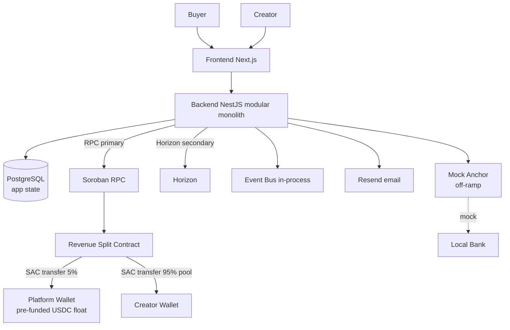

# .ai/architecture.md — Kreav Architecture Summary for AI Agents

> **Purpose:** A dense architectural map so an agent understands the system shape without reading every PRD. Pointers, not copies. ~300–500 lines.
> **For deep detail:** follow the links. This is the index.

---

## System shape (one diagram)

## The two state stores (ADR-007)
- **PostgreSQL = application state** — users, products, orders, settlement *records*, withdrawals, notification logs. System of record for app data + accounting history.
- **Stellar = settlement state** — wallet balances, trustlines, the split transaction. **Balance truth = live Horizon read** (never cached as authoritative in the DB).

## The money flow (the demo spine)
Buyer → **Payment Simulator** (simulated PSP, ADR-009/FE-007) → HMAC-signed payment event → backend webhook (verifies signature) → emits `payment.received` → SettlementService invokes `settle` (RPC) → contract splits USDC from the **platform float** (C1): 5%→platform, 95% pool→creator(s) → backend verifies via `getTransaction` → records 1 Settlement + N SettlementRecipient (mirror) → Order `SETTLED` → creator sees balance + txHash + explorer link → simulated withdrawal.

> **Two bounded contexts:** Payment Domain (simulated, replaceable — GCash/GoPay/Stripe) vs Settlement Domain (real, core — Stellar/Soroban/USDC). The storefront **never** calls the backend webhook directly; the Payment Simulator does.

## Backend module map (src/)
| Module | Owns | Status |
|--------|------|--------|
| `config/` | typed config + Joi env validation | ✅ done |
| `prisma/` | PrismaService (connect/disconnect lifecycle) | ✅ done |
| `common/` | `DecimalToStringInterceptor`, health, filters | ✅ done |
| `events/` | event bus: `AppEvents` names + typed payloads + log listener | ✅ done |
| `products/` | `GET/POST /products` | ✅ done (BE-004) |
| `orders/` | `POST /checkout`, `POST /webhooks/gcash`, 13-state machine, webhook HMAC | ✅ done (BE-005) |
| `stellar/` | RPC + Horizon + settlement invoke/verify | 🔜 **BE-007 (stub now)** |
| `wallets/` | connect / balance / withdraw | 🔜 BE-008/009 |
| `notifications/` | Resend adapter + NotificationLog + retry cron | 🔜 BE-013 |
| `app.module.ts` / `main.ts` | bootstrap: helmet, CORS, pipes, interceptors, throttler, rawBody, EventEmitter, Throttler | ✅ done |

## The settlement contract (one, MVP)
- **`settle(usdc_sac, source, order_ref, total_amount, recipients)`** — see [Soroban Contract PRD §3](../docs/stellar/Soroban-Contract-PRD.md).
- `source` = platform account (signs via `PLATFORM_WALLET_SECRET`); holds the **pre-funded USDC float**.
- `order_ref` = `Order.id` (idempotency).
- Splits: 5% platform fee first; 95% creator pool distributed by collaborator `revenue_percentage` (sum 100%).
- Atomic: all transfers succeed or the whole tx reverts.
- Security: `require_auth`, SAC allowlist, checked arithmetic, typed keys (soroban skill Part 3).

## The 13-state Order machine
`CREATED → CHECKOUT_STARTED → PAYMENT_PENDING → PAYMENT_RECEIVED → SETTLEMENT_PENDING → SETTLED → WITHDRAW_PENDING → WITHDRAW_COMPLETED`
Failure/deferral: `PAYMENT_FAILED`, `SETTLEMENT_FAILED`, `WITHDRAW_FAILED`, `WAITING_WALLET`, `CANCELLED`.
Only legal transitions pass. ([Runtime Flow §11](../docs/architecture/Runtime-Flow-Bible.md#11-order-state-machine))

## Event bus (in-process)
Names: `payment.received`, `wallet.connect.required`, `settlement.completed`. Typed payloads in `events/event-payloads.ts`. Synchronous emit; settlement handler runs the heavy work; webhook returns fast. **Lost on crash** → startup recovery job (audit #18, BE-012) resumes stuck `PAYMENT_RECEIVED`/`SETTLEMENT_PENDING` orders.

## Key data invariants
- 1 `Order` ↔ 1 `Settlement` ↔ 1 on-chain tx (1 `txHash`).
- 1 `Settlement` ↔ N `SettlementRecipient` (ADR-006).
- `Order.paymentRef` UNIQUE (idempotency, audit #5).
- Money: `Decimal(18,2)` everywhere; never float.

## Stellar mechanics (the rules that bite)
- **RPC primary** for Soroban (invoke/verify); **Horizon secondary** (balance/explorer) — ADR-005.
- **USDC classic via SAC** (not a custom token) — ED-3; **7 decimals** on-chain — ED-7.
- **Trustline required** to receive USDC; missing → `op_no_trust` → revert.
- **Invocation pattern:** `getAccount → build → simulateTransaction → assembleTransaction → sign → sendTransaction → poll getTransaction`. Never raw invoke.
- **Platform = sole settlement signer** (ED-2/ED-10); creators only receive (non-custodial).
- **Pre-funded float** (C1/ED-9): platform account pre-funded; depletes ~−10 USDC/sale; top up before it runs dry.

## Failure handling (summary)
- Payment fail → `PAYMENT_FAILED` (no chain interaction).
- Settlement fail → `SETTLEMENT_FAILED` (retry verify ≤3, then manual).
- No wallet/trustline → `WAITING_WALLET` (defer, not fail).
- RPC/Horizon timeout → `SETTLEMENT_PENDING` (retry verify).
- Withdrawal fail → `Withdrawal.FAILED` (funds safe; mock moved nothing).
- See [Error-Codes](../docs/api/Error-Codes.md) + [Backend PRD §20](../docs/backend/Backend-PRD.md).

## What's mocked vs real (the demo honesty line)
- **REAL (testnet):** Stellar accounts, trustlines, USDC, the split contract, the settlement tx, txHash, wallet balance.
- **MOCK:** GCash payment, the anchor off-ramp, the local bank payout, KYC. The mock anchor implements SEP-24 *shape* so a real anchor is a drop-in.

## Non-goals (don't build these)
Marketplace, social, followers, subscriptions, discovery, affiliate, real bank/GCash, real anchor/KYC, DeFi/lending/yield, multi-currency, mobile app, NFTs/streaming/staking contracts. (All explicitly out of MVP — [Product Scope](../docs/product/Product-Scope.md).)

## When you're about to build something, check
1. Is it in scope (backend)? — [.ai/context.md](./context.md)
2. Does it break an invariant? — [.ai/rules.md](./rules.md)
3. Is there an ADR already? — [docs/adr/](../docs/adr/)
4. What's the sequence? — [Sequence Diagram Bible](../docs/architecture/Sequence-Diagram-Bible.md)
5. What error codes apply? — [Error-Codes](../docs/api/Error-Codes.md)
6. Money/DB/stellar rules? — [DB Bible](../docs/database/Database-Bible.md), [Stellar Standards](../docs/stellar/Stellar-Standards-PRD.md)

---

*This is the index. Detail lives in the linked docs — read the specific one before implementing.*
