# Kreav Sequence Diagram Bible

> **Status:** Canonical. Every backend, frontend, blockchain, QA engineer, and AI agent must implement flows exactly as diagrammed here.
> **Authority hierarchy on conflict:** Official Stellar docs → Architecture Consistency Check → Kreav Backend PRD v3.1 → these diagrams. Where a diagram conflicts with the Backend PRD on Stellar mechanics (RPC/Horizon/SAC), the **Stellar Standards PRD** governs.
> **Actor legend:** `👤` human actor · `🖥️` frontend · `⚙️` backend service · `🗄️` database · `📡` Stellar RPC · `🔭` Horizon · `📜` Soroban contract · `🏦` anchor · `👛` wallet · `✉️` notification · `🚌` event bus.

---

## Table of Contents

**Lifecycle (1–19)**
1. Creator Registration · 2. Wallet Connection · 3. Product Upload · 4. Collaborator Invitation · 5. Collaborator Acceptance · 6. Checkout · 7. Payment Success · 8. Payment Failure · 9. Payment Retry · 10. Settlement · 11. Settlement Retry · 12. Waiting Wallet Flow · 13. Missing Trustline Flow · 14. Withdrawal · 15. Withdrawal Failure · 16. Notification Delivery · 17. Email Retry · 18. Wallet Balance Refresh · 19. Product Purchase Complete

**Infrastructure (20–29)**
20. System Startup · 21. Health Check · 22. Idempotent Webhook · 23. Duplicate Payment Protection · 24. Contract Invocation · 25. RPC Verification · 26. Transaction Recording · 27. Explorer Verification · 28. Background Cron Jobs · 29. Scheduled Retry

**End-to-end (30)**
30. Complete End-to-End Happy Path

---

## 1. Creator Registration

> MVP note: buyers are anonymous (no registration). Only creators register. In the demo, the creator is seeded (BE-011). This is the general flow for a creator-supplied account.

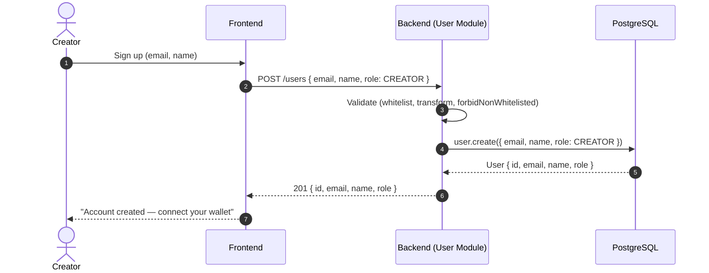

**Explanation.** Registration creates a `User` with `role = CREATOR`. No wallet yet, no Stellar interaction — registration is pure application state. Money flows begin only after wallet connection (Seq. 2) and a USDC trustline exists. The creator's Stellar account must be **externally** funded + trustlined (non-custodial — the backend never creates accounts or trustlines).

---

## 2. Wallet Connection

> Non-custodial: the backend stores **only the public key**.

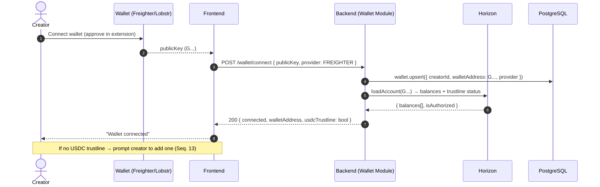

**Explanation.** The wallet connection stores the public key + provider only. The backend immediately queries Horizon to learn the USDC trustline status — this drives the pre-settlement `WAITING_WALLET` vs proceed decision (Seq. 12/13). The backend never requests signing authority, never sees the secret key. If the wallet has no USDC trustline, the frontend nudges the creator to create one (a `changeTrust` op the creator signs in their own wallet).

---

## 3. Product Upload

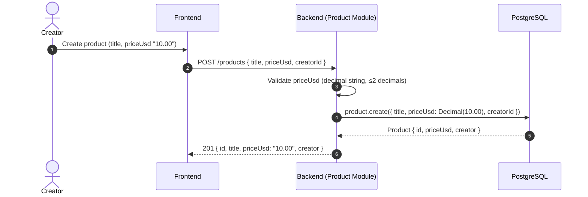

**Explanation.** `priceUsd` is accepted as a **decimal string** (never a JS number — precision risk past 2^53). It is stored as `Decimal(18,2)`. The global `DecimalToStringInterceptor` returns it as `"10.00"` so money never appears as Prisma's internal `{d:[...]}`. No collaborators yet — a single-creator product has the creator as the implicit 100% recipient.

---

## 4. Collaborator Invitation

> v3.1 §19 — multi-collaborator split. A product may have N collaborators whose `revenue_percentage` values must sum to 100% of the creator pool.

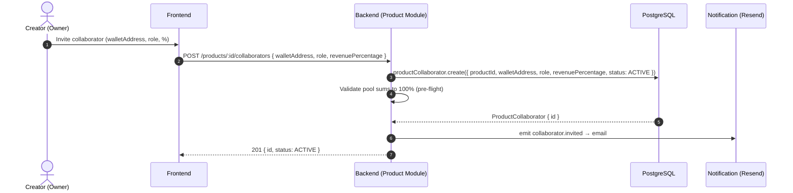

**Explanation.** Collaborators are linked to a product with a `revenue_percentage` and a `walletAddress` (their own non-custodial wallet). The backend validates that the **creator pool sums to 100%** at this point (and again authoritatively inside the contract at settle time — defense in depth). If the sum drifts, the product cannot be settled until fixed.

---

## 5. Collaborator Acceptance

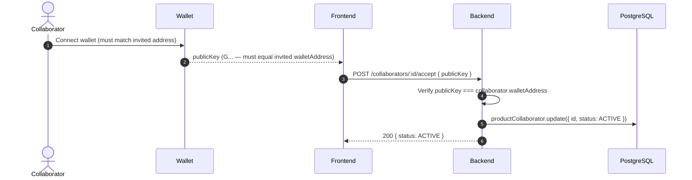

**Explanation.** Acceptance confirms the collaborator controls the invited wallet (the connected wallet's public key must match). For the demo, collaborators are pre-seeded ACTIVE. MVP does not require an off-chain signature challenge; the wallet-address match is sufficient.

---

## 6. Checkout

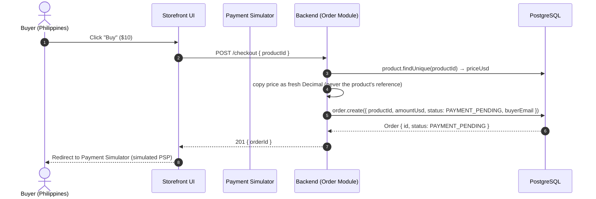

**Explanation.** Checkout creates the Order at `PAYMENT_PENDING` (v3.1 §20 state machine). The amount is copied as a **fresh Decimal** to avoid aliasing the product row (a later price change could otherwise corrupt a pending order). The order is now awaiting the payment event. Per [ADR-009](../adr/ADR-009-Why-Simulated-Payment-Provider.md), the storefront redirects to the **Payment Simulator** (a simulated PSP) — **the storefront never calls the backend webhook directly.** The buyer never touches blockchain.

---

## 7. Payment Success

> The signed payment event is the trigger for the whole settlement flow. HMAC signature verified first (audit #11). Per [ADR-009](../adr/ADR-009-Why-Simulated-Payment-Provider.md), the **Payment Simulator** (simulated PSP) sends this event — the backend is provider-agnostic.

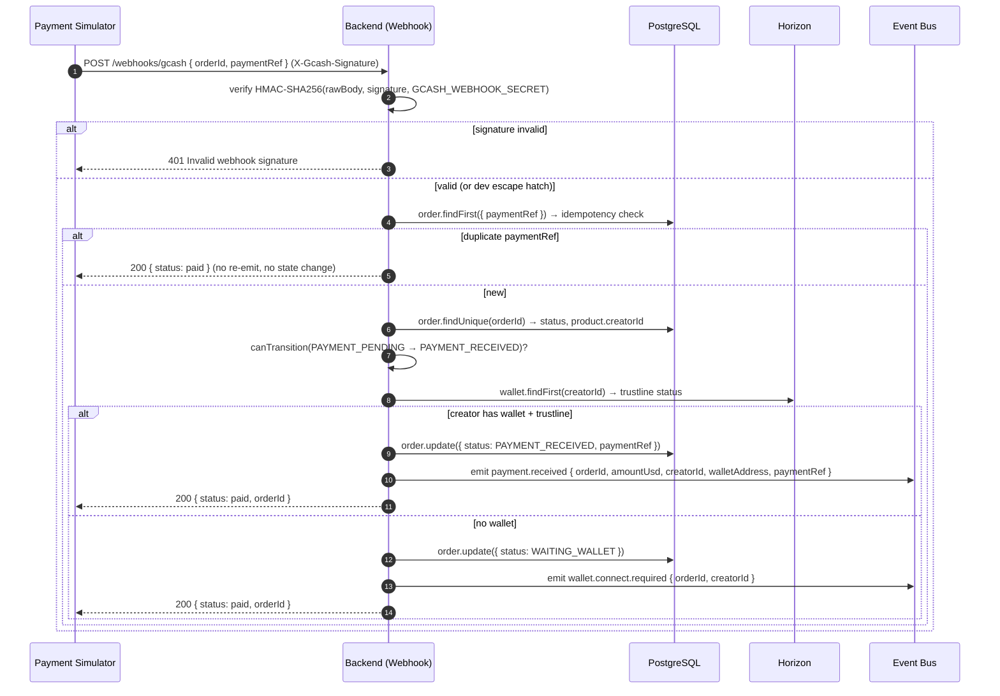

**Explanation.** Three guards fire before any state change: **(1)** HMAC signature (audit #11) — the backend **verifies** (not "trusts") the signed payment event from the Payment Simulator, **(2)** `paymentRef` idempotency (audit #5 — a duplicate event is acknowledged but does nothing), **(3)** state-machine transition legality (v3.1 §20). Then the creator's wallet + trustline are checked: present → `PAYMENT_RECEIVED` + emit `payment.received`; absent → `WAITING_WALLET` + emit `wallet.connect.required`. The webhook returns fast; settlement runs async via the event bus (Seq. 10).

---

## 8. Payment Failure

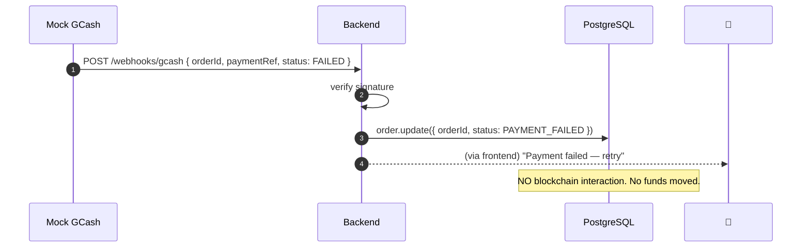

**Explanation.** A payment failure is purely application state: `Order → PAYMENT_FAILED` (a terminal failure state, v3.1 §20). No Stellar interaction occurs — no settlement, no funds at risk. The buyer may retry checkout (a new order).

---

## 9. Payment Retry

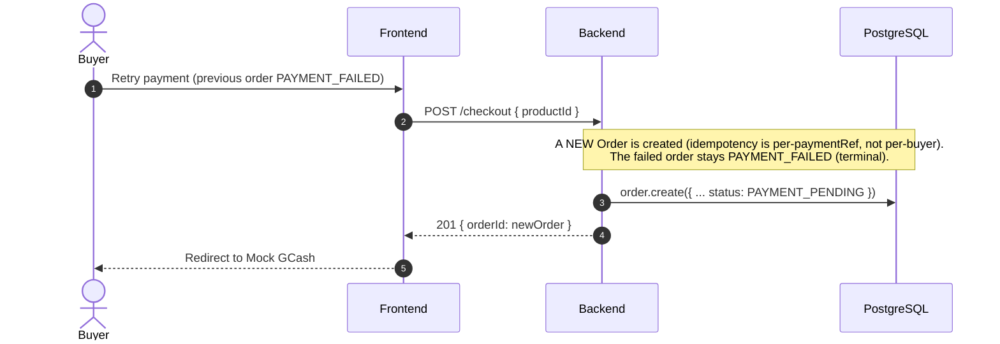

**Explanation.** Retry = a **new order**, because the failed order is terminal (`PAYMENT_FAILED` cannot transition). Idempotency is guaranteed per `paymentRef` (a payment can only ever settle one order), not per buyer. This keeps the failure path simple and auditable.

---

## 10. Settlement

> The WOW moment. Real testnet USDC moves atomically via the Soroban split contract.
>
> **Pre-condition (ADR C1 — pre-funded float):** the platform account (`source`) must hold enough testnet USDC to cover the settlement. The team pre-funds it out-of-band (Implementation Backlog **BC-011**); the buyer's GCash payment is mocked and mints no USDC. Each settlement draws the float down by the full purchase amount. If the float is depleted, the SAC `transfer` reverts on insufficient balance → `SETTLEMENT_FAILED`. The `order_ref` passed to `settle` = `Order.id` (ADR H2).

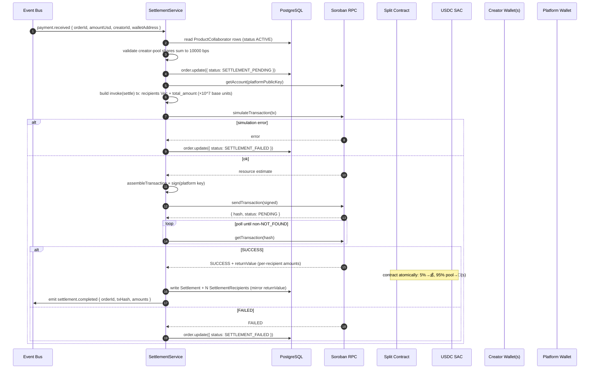

**Explanation.** The settlement service consumes `payment.received`, validates collaborator shares (pre-flight), then drives the contract via the canonical RPC pattern: `getAccount → build → simulateTransaction → assembleTransaction → sign → sendTransaction → poll getTransaction`. On `SUCCESS`, it records **one `Settlement`** row + **N `SettlementRecipient`** rows that **mirror the contract's return value** (never an independent recompute). The platform account is the sole signer (Stellar Standards ED-2). Atomicity is guaranteed by Soroban — all transfers succeed or the whole tx reverts (no partial payouts).

---

## 11. Settlement Retry

> Retries are on **verification**, never on **invocation** (double-settle risk).

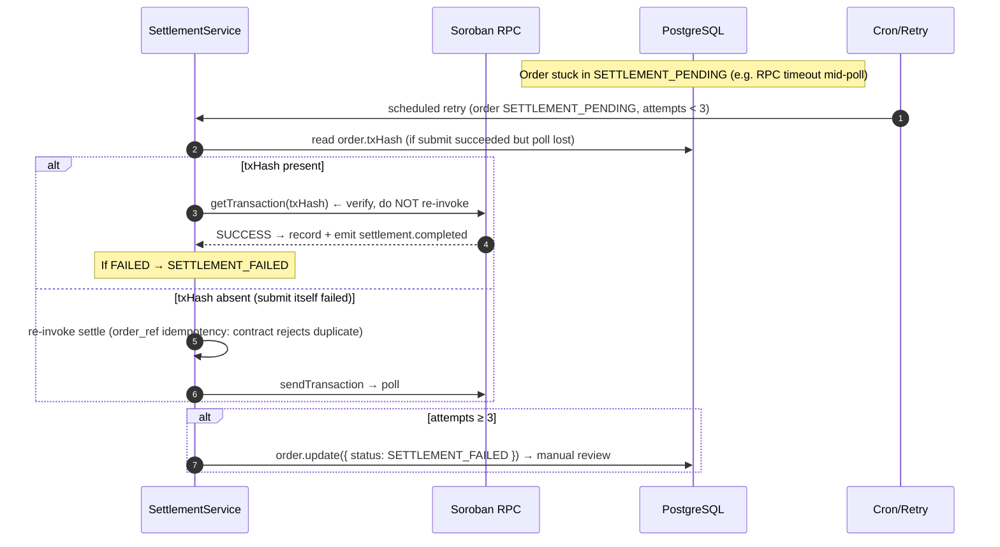

**Explanation.** The cardinal rule: **never re-invoke a settle that already returned SUCCESS.** If the submit returned a txHash, retry only the *verify poll*. If submit itself failed (no txHash), re-invocation is safe because the contract's `order_ref` idempotency guard rejects duplicates (Soroban Contract PRD §9). After 3 attempts → `SETTLEMENT_FAILED` + manual review (Backend PRD §20).

---

## 12. Waiting Wallet Flow

> v3.1 §20 — payment received but creator has no connected wallet. Settlement deferred, not rejected.

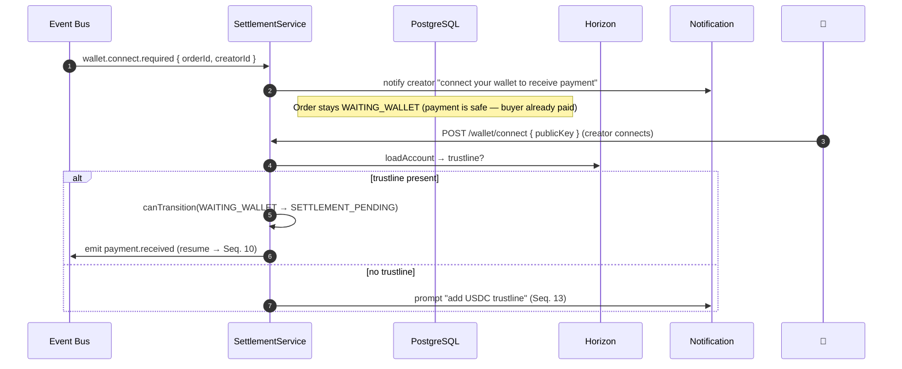

**Explanation.** `WAITING_WALLET` is a **deferral**, not a failure — the buyer's payment is already confirmed; only the payout is waiting. When the creator connects a wallet (and has a trustline), the order resumes via `WAITING_WALLET → SETTLEMENT_PENDING` and re-emits `payment.received`. No money is at risk; the funds are still the buyer's until the contract splits them.

---

## 13. Missing Trustline Flow

> A creator wallet without a USDC trustline → SAC `transfer` fails `op_no_trust` → settlement reverts.

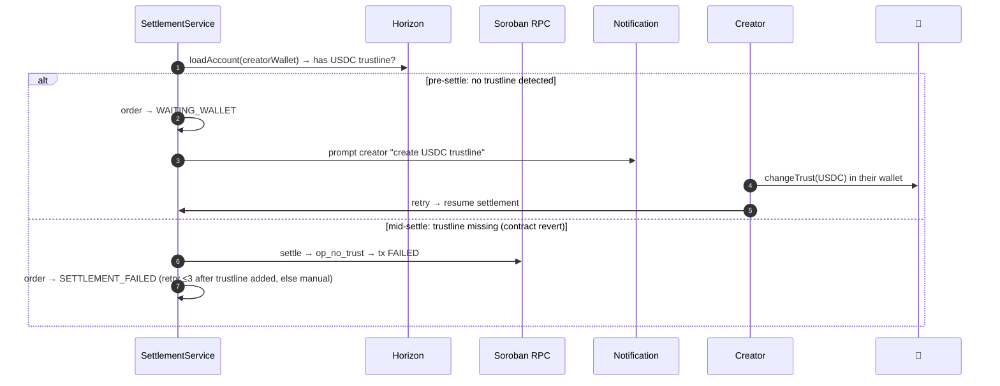

**Explanation.** Two detection points, both mapped to defined states (Backend PRD §20 + this revision): **pre-settlement** (Horizon balance check) → `WAITING_WALLET`; **mid-settlement** (contract revert) → `SETTLEMENT_FAILED`. The atomicity guarantee means a missing trustline never causes partial payout — the whole tx reverts. The creator must add the trustline in their own wallet (non-custodial: backend cannot do it).

---

## 14. Withdrawal

> MVP: mocked anchor (SEP-24 shape). Real off-ramp is Future (Anchor PRD).

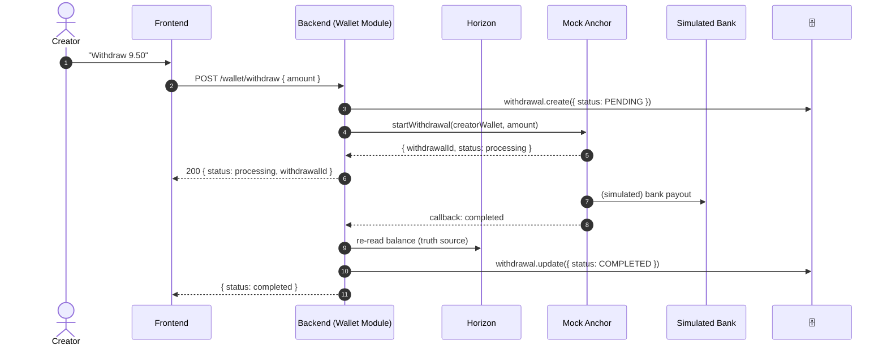

**Explanation.** The withdrawal is **simulated** in MVP — no real USDC leaves the creator's wallet (the mock anchor doesn't actually move funds). The creator's settlement receipt is real (9.50 USDC verifiable on-chain); only the bank payout is mock. The backend records a `Withdrawal` row with status `PENDING → COMPLETED`. Balance truth always comes from Horizon, never from the anchor's claim (Anchor PRD §5).

---

## 15. Withdrawal Failure

```mermaid
sequenceDiagram
    autonumber
    participant 🏦 as Mock/Real Anchor
    participant ⚙️ as Backend
    participant 🗄️ as PostgreSQL
    participant ✉️ as Notification

    🏦-->>⚙️: callback: failed (or timeout)
    ⚙️->>🗄️: withdrawal.update({ status: FAILED })
    ⚙️->>✉️: notify creator "withdrawal failed — your funds are safe in your wallet"
    Note over 🗄️: Creator funds remain in wallet. NO loss of funds.<br/>(MVP: mock anchor moved nothing; real anchor holds funds during swap)
```

**Explanation.** A withdrawal failure never causes fund loss in MVP (the mock anchor moved nothing; in the real design the anchor is the counterparty holding funds during the swap). `Withdrawal.status → FAILED`, the creator is notified, and the funds remain in their wallet. The backend never auto-retries a withdrawal blindly (idempotency on withdrawal intent).

---

## 16. Notification Delivery

> v3.1 §18 — Resend via Adapter Pattern; NotificationLog for durable retry.

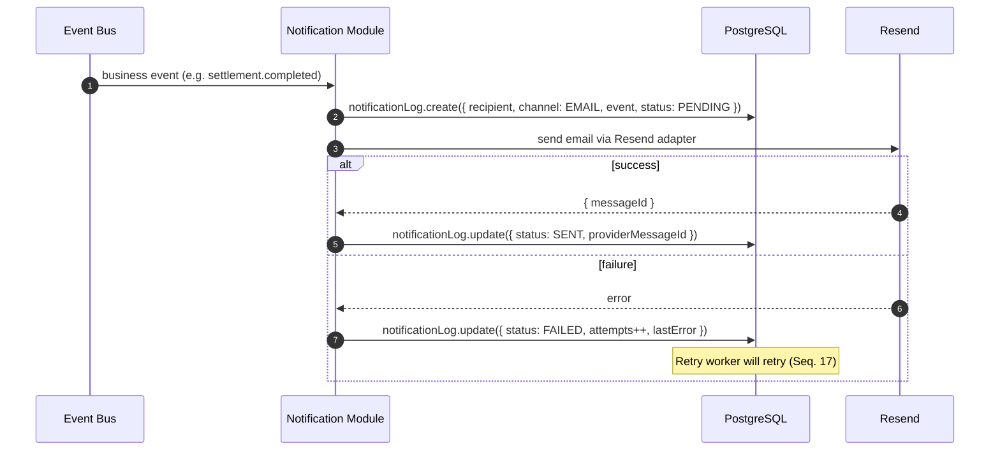

**Explanation.** Notifications are **async and never block** the business flow. Every notification is recorded as a `NotificationLog` row (durable retry state) before the send attempt. On failure, the log's `attempts` increments and the retry worker (Seq. 17) handles it. A notification failure never rolls back a settlement or withdrawal.

---

## 17. Email Retry

> 3 retries with exponential backoff (v3.1 §18).

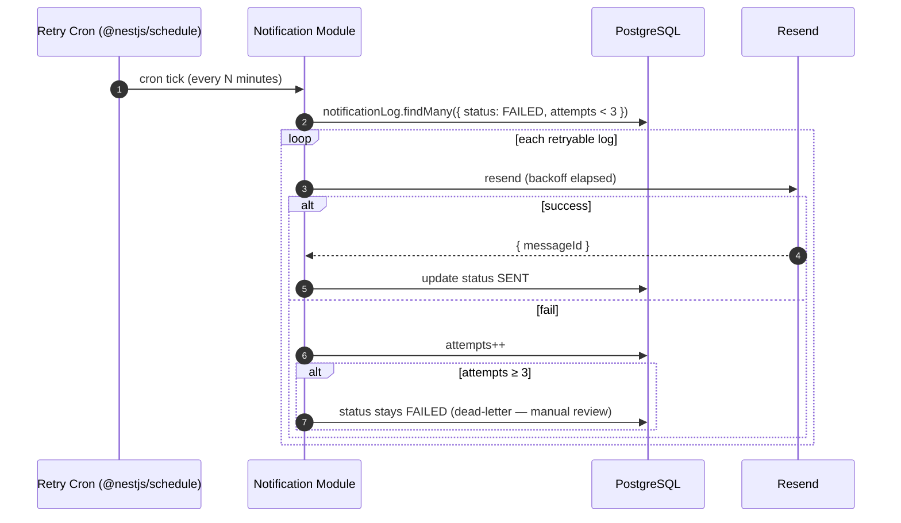

**Explanation.** The retry cron scans `NotificationLog` for FAILED rows under the retry cap, resends with exponential backoff, and dead-letters after 3 attempts. This survives process restarts because state is in PostgreSQL, not memory (audit #19).

---

## 18. Wallet Balance Refresh

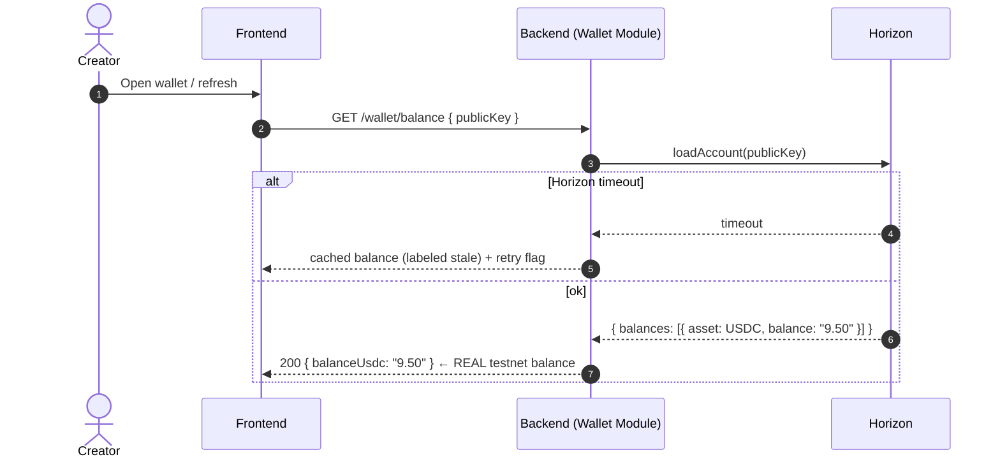

**Explanation.** Balance is always a **live Horizon read** — never cached as the source of truth (money truth = the chain). On Horizon timeout, a stale cached value may be returned but must be labeled stale (audit #20 — Testnet reliability). The displayed balance reflects the real on-chain USDC credit balance.

---

## 19. Product Purchase Complete

> The composite happy-path for a single purchase (excludes the full demo chrome).

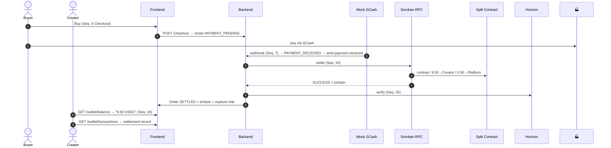

**Explanation.** This is the money-movement spine: checkout → webhook → settlement → verify → display. Every step is real on testnet except the GCash payment. The creator sees the 9.50 USDC balance and the settlement transaction record, with an explorer link for on-chain proof.

---

## 20. System Startup

```mermaid
sequenceDiagram
    autonumber
    participant ☁️ as Container/Process
    participant ⚙️ as NestJS App
    participant ✅ as Config (Joi)
    participant 🗄️ as Prisma/PostgreSQL
    participant 📡 as Soroban RPC
    participant 🔭 as Horizon
    participant ⏰ as Cron/Schedule
    participant 🔄 as Recovery Job

    ☁️->>⚙️: SIGTERM-received=false; start
    ⚙️->>✅: ConfigModule.load → Joi validate env (DATABASE_URL, SOROBAN_RPC_URL, ...)
    alt env invalid
        ✅-->>⚙️: throw (abortEarly: false) → process exits
    end
    ⚙️->>⚙️: Helmet + CORS + ValidationPipe + DecimalToStringInterceptor + ThrottlerGuard
    ⚙️->>⚙️: EventEmitterModule.forRoot() + ThrottlerModule.forRoot()
    ⚙️->>🗄️: PrismaClient.$connect()
    ⚙️->>📡: (lazy) RPC client ready
    ⚙️->>🔭: (lazy) Horizon client ready
    ⚙️->>🔄: startup recovery: find orders PAYMENT_RECEIVED/SETTLEMENT_PENDING (audit #18)
    ⚙️->>⏰: register cron jobs (retry worker)
    ⚙️->>☁️: listen on PORT
```

**Explanation.** Startup validates env **first** (fail fast on missing config — audit #6). Then NestJS DI wires modules; Prisma connects. The **startup recovery job** (audit #18) resumes orders stuck in `PAYMENT_RECEIVED`/`SETTLEMENT_PENDING` — without it, a crash mid-settlement leaves stuck money. Crons register last. The app enables shutdown hooks so SIGTERM drains gracefully (Seq. graceful shutdown, Runtime Flow Bible).

---

## 21. Health Check

```mermaid
sequenceDiagram
    autonumber
    participant 🩺 as Probe (Railway/uptime)
    participant ⚙️ as Backend
    participant 🗄️ as PostgreSQL

    🩺->>⚙️: GET /health
    alt MVP (shallow)
        ⚙️-->>🩺: 200 { status: ok }
    else deep (audit #15 — readiness)
        ⚙️->>🗄️: SELECT 1
        🗄️-->>⚙️: ok
        ⚙️-->>🩺: 200 { status: ok, db: ok }
    end
```

**Explanation.** MVP `/health` returns ok if the process is up. A **deep** readiness check (`SELECT 1`) is needed for Railway to know when the container can receive traffic (audit #15). Without it, Railway routes traffic to a container whose DB connection isn't ready yet.

---

## 22. Idempotent Webhook

> The same webhook delivered twice (network retry by GCash) must settle once.

```mermaid
sequenceDiagram
    autonumber
    participant 🏧 as Mock GCash
    participant ⚙️ as Backend
    participant 🗄️ as PostgreSQL
    participant 📡 as RPC

    🏧->>⚙️: webhook #1 { orderId, paymentRef } → settles
    Note over 🗄️: order.paymentRef = paymentRef (UNIQUE)
    🏧->>⚙️: webhook #2 { same paymentRef }
    ⚙️->>🗄️: order.findFirst({ paymentRef }) → EXISTS
    ⚙️-->>🏧: 200 { status: paid } (ack, no re-emit, no re-settle)
    Note over ⚙️,📡: settlement NOT invoked again. Contract order_ref guard also defends.
```

**Explanation.** Idempotency is **defense in depth**: (1) the backend's `paymentRef` lookup short-circuits before any state change; (2) the DB UNIQUE constraint on `Order.paymentRef` (audit #5) makes duplicates impossible to persist; (3) the contract's `order_ref` guard rejects a duplicate invocation. A duplicate webhook is acknowledged (200) so GCash stops retrying, but does nothing.

---

## 23. Duplicate Payment Protection

> Two *different* orders, same `paymentRef` (shouldn't happen, but the system must be safe).

```mermaid
sequenceDiagram
    autonumber
    participant ⚙️ as Backend
    participant 🗄️ as PostgreSQL

    ⚙️->>🗄️: webhook { orderId: A, paymentRef: X }
    Note over 🗄️: order A clamping paymentRef = X (UNIQUE)
    ⚙️->>🗄️: webhook { orderId: B, paymentRef: X }
    ⚙️->>🗄️: order.findFirst({ paymentRef: X }) → order A already owns it
    ⚙️-->>: 200 ack (idempotent) — order B does NOT get settled on X
    Note over 🗄️: A payment maps to exactly one order. Double-spend impossible.
```

**Explanation.** A single payment (`paymentRef`) can ever settle **one** order. The `findFirst({ paymentRef })` check binds the payment to its first-seen order; a second order referencing the same payment is acknowledged but not settled. This is the core anti-double-spend invariant.

---

## 24. Contract Invocation

> Detailed view of the RPC invoke pattern (canonical, per the `data` skill).

```mermaid
sequenceDiagram
    autonumber
    participant ⚙️ as SettlementService
    participant 📡 as Soroban RPC
    participant 📜 as Split Contract

    ⚙️->>📡: getAccount(platformPublicKey)
    📡-->>⚙️: { sequence }
    ⚙️->>⚙️: build tx: contract.call('settle', usdc_sac, source, total, recipients)
    ⚙️->>📡: simulateTransaction(tx)
    alt isSimulationError
        📡-->>⚙️: error → SETTLEMENT_FAILED
    else isSimulationSuccess
        📡-->>⚙️: { cost, result, footprint }
        ⚙️->>⚙️: assembleTransaction(tx, sim) → attach resources
        ⚙️->>⚙️: sign(platformKeypair)
        ⚙️->>📡: sendTransaction(signed)
        📡-->>⚙️: { hash, status: PENDING }
    end
```

**Explanation.** The contract is **never** invoked without simulation first. Simulation returns the resource footprint; `assembleTransaction` attaches it; only then is the signed tx submitted. Skipping simulation produces a tx the network rejects. This pattern is mandatory (Stellar Standards PRD §12).

---

## 25. RPC Verification

> How the backend knows the split truly happened.

```mermaid
sequenceDiagram
    autonumber
    participant ⚙️ as SettlementService
    participant 📡 as Soroban RPC

    ⚙️->>📡: getTransaction(txHash)
    alt NOT_FOUND
        📡-->>⚙️: NOT_FOUND → wait 1s → retry (loop)
    else SUCCESS
        📡-->>⚙️: { status: SUCCESS, returnValue, ledger }
        Note over ⚙️: returnValue = per-recipient distributed amounts
    else FAILED
        📡-->>⚙️: { status: FAILED, errorResult }
    end
```

**Explanation.** `rpc.getTransaction(hash)` is the authoritative verification (Stellar Standards §7). `returnValue` carries the contract's result (the distributed amounts), which the backend mirrors into `SettlementRecipient` rows. The poll loop handles the ~5s ledger inclusion latency. RPC's 7-day history window is fine here (verification runs seconds after submit).

---

## 26. Transaction Recording

```mermaid
sequenceDiagram
    autonumber
    participant ⚙️ as SettlementService
    participant 🗄️ as PostgreSQL

    ⚙️->>⚙️: getTransaction returned SUCCESS + returnValue
    ⚙️->>🗄️: settlement.create({ orderId, totalAmount, txHash, status: COMPLETED })
    🗄️-->>⚙️: settlement { id }
    loop per recipient in returnValue
        ⚙️->>🗄️: settlementRecipient.create({ settlementId, walletAddress, recipientType, role, percentage, amount })
    end
    ⚙️->>🗄️: order.update({ status: SETTLED, txHash })
    ⚙️->>🚌: emit settlement.completed
```

**Explanation.** The recording **mirrors** the contract's output (one `Settlement` + N `SettlementRecipient`), derived from `returnValue` — never an independent recompute. This guarantees the DB and the chain never disagree about who received what. The order moves to `SETTLED` only after the record is durable.

---

## 27. Explorer Verification

> The demo's "verify on-chain" moment (Screen 7).

```mermaid
sequenceDiagram
    autonumber
    actor 🧑 as Judge/Creator
    participant 🖥️ as Frontend
    participant 🔭 as Horizon/Explorer
    participant 📡 as RPC

    🖥️->>🔭: open explorer URL (stellar.expert / stellarchain) with txHash
    🔭-->>🖥️: { hash, sender, recipients, amounts, ledger, success }
    Note over 🧑,🖥️: Human-verifiable: 9.50 USDC → Creator, 0.50 → Platform
    🖥️->>📡: (optional) getTransaction cross-check
```

**Explanation.** The explorer link is the trust anchor for the audience — anyone can independently verify the split happened. The backend supplies the txHash + a deep link; the explorer renders the human-readable proof. The backend may cross-check via RPC `getTransaction` for reconciliation (Soroban Contract PRD §12).

---

## 28. Background Cron Jobs

```mermaid
sequenceDiagram
    autonumber
    participant ⏰ as Scheduler (@nestjs/schedule)
    participant ⚙️ as Backend
    participant 🗄️ as PostgreSQL
    participant ✉️ as Resend
    participant 📡 as RPC

    loop every N min — notification retry (Seq. 17)
        ⏰->>⚙️: cron → notificationLog.findMany(FAILED, attempts<3)
        ⚙️->>✉️: resend
    end
    loop every M min — settlement recovery (audit #18)
        ⏰->>⚙️: cron → orders in SETTLEMENT_PENDING → verify poll
        ⚙️->>📡: getTransaction
    end
    loop every K min — startup recovery one-shot
        Note over ⚙️: on boot only: resume PAYMENT_RECEIVED/SETTLEMENT_PENDING
    end
```

**Explanation.** Two recurring crons: **notification retry** (Seq. 17) and **settlement verification recovery** (resume stuck `SETTLEMENT_PENDING` orders — audit #18). The startup recovery runs once at boot (Seq. 20). Cron state lives in PostgreSQL so it survives restarts (audit #19).

---

## 29. Scheduled Retry

> Generic retry mechanism (settlement verify, notification, Horizon reads).

```mermaid
sequenceDiagram
    autonumber
    participant ⚙️ as Retry Orchestrator
    participant 🗄️ as PostgreSQL
    participant ➡ as Target (RPC/Resend/Horizon)

    ⚙️->>🗄️: find rows { status: retryable, attempts < MAX, nextAttemptAt <= now }
    loop each candidate (exponential backoff)
        ⚙️->>➡: attempt
        alt success
            ➡-->>⚙️: ok → mark COMPLETED
        else fail
            ➡-->>⚙️: error → attempts++, nextAttemptAt = now + backoff
            alt attempts ≥ MAX
                ⚙️->>🗄️: mark FAILED (dead-letter / manual review)
            end
        end
    end
```

**Explanation.** Retries are **state-driven** (nextAttemptAt + attempts in the DB), not in-memory timers. Exponential backoff bounds load. After the max (3 for settlement/notification — Backend PRD §20), the row is dead-lettered for manual review. This makes retries crash-safe.

---

## 30. Complete End-to-End Happy Path

> The full demo spine: the 30-second "money moved from buyer to creator, verifiable on-chain."
>
> **Pre-condition (ADR C1):** the platform account is pre-funded with testnet USDC (BC-011) and holds a USDC trustline; creator wallets are pre-funded + pre-trustlined. The buyer's GCash payment is mocked.

```mermaid
sequenceDiagram
    autonumber
    actor 🧑 as Buyer (Philippines)
    actor 👤 as Creator (Indonesia)
    participant 🖥️ as Frontend
    participant ⚙️ as Backend
    participant 🏧 as Mock GCash
    participant 🚌 as Event Bus
    participant 📡 as Soroban RPC
    participant 📜 as Split Contract
    participant 💸 as USDC SAC
    participant 👛 as Creator Wallet
    participant 💰 as Platform Wallet
    participant 🔭 as Horizon
    participant 🏦 as Mock Anchor
    participant ✉️ as Notification
    participant 🗄️ as PostgreSQL

    %% Purchase
    🧑->>🖥️: Buy "AI Interview Playbook" $10
    🖥️->>⚙️: POST /checkout → Order PAYMENT_PENDING

    %% Payment
    🧑->>🏭: pay via GCash (mock)
    🏧->>⚙️: POST /webhooks/gcash { orderId, paymentRef } (HMAC-signed)
    ⚙️->>⚙️: verify signature + paymentRef idempotency
    ⚙️->>🗄️: Order → PAYMENT_RECEIVED
    ⚙️->>🚌: emit payment.received

    %% Settlement (WOW)
    🚌->>⚙️: SettlementService
    ⚙️->>⚙️: validate collaborators (sum 100%)
    ⚙️->>🗄️: Order → SETTLEMENT_PENDING
    ⚙️->>📡: getAccount → build → simulate → assemble → sign → sendTransaction
    📡->>📜: settle(total=10 USDC, recipients)
    📜->>💸: transfer 0.50 → 💰 (platform 5%)
    📜->>💸: transfer 9.50 → 👛 (creator 95%)
    📡-->>⚙️: SUCCESS + txHash + returnValue

    %% Verify + record
    ⚙️->>📡: getTransaction(txHash) → SUCCESS
    ⚙️->>🗄️: Settlement + SettlementRecipients (mirror)
    ⚙️->>🗄️: Order → SETTLED
    ⚙️->>🚌: emit settlement.completed
    🚌->>✉️: notify creator "You received 9.50 USDC"

    %% Display proof
    👤->>🖥️: GET /wallet/balance
    🖥️->>⚙️: → 🔭 loadAccount → "9.50 USDC"
    👤->>🖥️: GET /wallet/transactions → settlement record + txHash
    👤->>🖥️: click explorer link → 🔭 proof

    %% Withdrawal (mock)
    👤->>🖥️: Withdraw 9.50
    🖥️->>⚙️: POST /wallet/withdraw
    ⚙️->>🏦: startWithdrawal (mock) → processing
    🏦-->>⚙️: completed (simulated)
    ⚙️->>🗄️: Withdrawal → COMPLETED
    ⚙️-->>🖥️: done
```

**Explanation.** This is the minimum winning demo (Definition of Done): buyer pays → Soroban splits 9.50/0.50 → creator sees real balance + txHash + explorer link → mock withdrawal completes. Everything in the Stellar subgraph (RPC, contract, SAC, wallets, Horizon) is **real on testnet**; GCash and the bank/anchor payout are **mocked** (Backend PRD §15; Anchor PRD §0). The whole sequence targets ~3 minutes (Demo PRD).

---

*Cross-reference: runtime behavior of each service → **Kreav Runtime Flow Bible**; deployment of these flows → **Kreav Deployment PRD**; testing them → **Kreav Testing PRD**; security of each → **Kreav Security PRD**; visibility into each → **Kreav Observability PRD**.*
