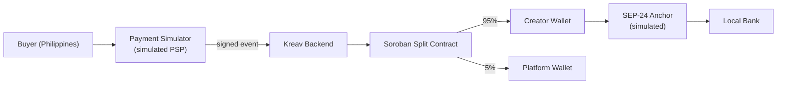
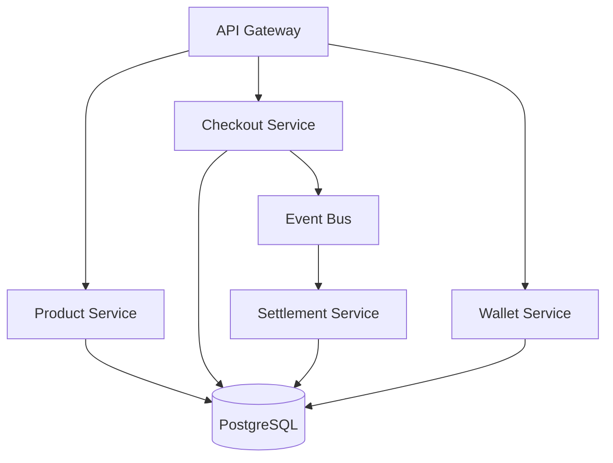
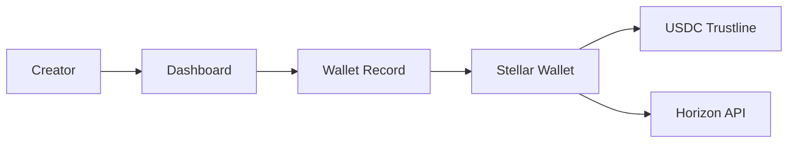

# Kreav — Final Architecture Diagram v1

## APAC Stellar Hackathon 2026

---

# High-Level Architecture

```mermaid
graph TB

    Buyer[Buyer<br/>Philippines]

    Creator[Creator<br/>Indonesia]

    subgraph Frontend
        Storefront[Product Storefront]
        Checkout[Checkout UI]
        PaymentSim[Payment Simulator<br/>(simulated PSP)]
        Dashboard[Creator Dashboard]
        WalletUI[Wallet UI]
    end

    subgraph Backend["Kreav Backend (NestJS)"]
        APIGateway[API Gateway]

        ProductService[Product Service]

        CheckoutService[Checkout Service]

        WalletService[Wallet Service]

        SettlementService[Settlement Service]

        EventBus[Event Bus]
    end

    subgraph Database
        PostgreSQL[(PostgreSQL)]
    end

    subgraph Stellar
        Soroban[Revenue Split Contract]

        Horizon[Horizon API]

        CreatorWallet[Creator Stellar Wallet]

        PlatformWallet[Platform Stellar Wallet]
    end

    subgraph External
        Anchor[Mock SEP-24 Anchor]

        Explorer[Stellar Explorer]
    end

    Buyer --> Storefront

    Storefront --> Checkout

    Checkout --> PaymentSim

    PaymentSim -->|signed payment event| APIGateway

    Creator --> Dashboard

    Dashboard --> APIGateway

    WalletUI --> APIGateway

    APIGateway --> ProductService

    APIGateway --> CheckoutService

    APIGateway --> WalletService

    ProductService --> PostgreSQL

    CheckoutService --> PostgreSQL

    WalletService --> PostgreSQL

    CheckoutService --> EventBus

    EventBus --> SettlementService

    SettlementService --> Soroban

    Soroban -->|95%| CreatorWallet

    Soroban -->|5%| PlatformWallet

    SettlementService --> Horizon

    WalletService --> Horizon

    CreatorWallet --> Anchor

    Anchor --> Creator

    CreatorWallet --> Explorer
```

---

# Money Flow



---

# Backend Architecture



---

# Event Flow

```mermaid
sequenceDiagram

    participant Buyer

    participant Checkout

    participant Backend

    participant EventBus

    participant Settlement

    participant Soroban

    participant CreatorWallet

    Buyer->>Checkout:
    Purchase Product

    Checkout->>Backend:
    Payment Success

    Backend->>EventBus:
    payment.received

    EventBus->>Settlement:
    Settlement Triggered

    Settlement->>Soroban:
    Execute Split

    Soroban->>CreatorWallet:
    95%

    Soroban->>PlatformWallet:
    5%

    Settlement->>EventBus:
    settlement.completed

    EventBus->>Backend:
    Update Wallet

    Backend->>Creator:
    Balance Updated
```

---

# Wallet Architecture



---

# Responsibilities

## Frontend

Owns:

* Storefront
* Checkout
* Creator Dashboard
* Wallet UI
* Explorer Link

---

## Backend

Owns:

* Products
* Orders
* Wallet Records
* Settlement Trigger
* Event Processing
* API

---

## Blockchain

Owns:

* Stellar Accounts
* Trustlines
* Soroban Contract
* Revenue Split
* Horizon Integration
* Transaction Verification

---

# Architecture Principles

1. Stellar is the settlement layer.

2. Soroban is only used for programmable revenue split.

3. PostgreSQL stores application state.

4. Blockchain stores settlement state.

5. Buyers never interact with blockchain.

6. Creators never need crypto knowledge.

7. Every blockchain action must be visible in the demo.

8. Complexity must be minimized.

---

# Final System Statement

Kreav uses Stellar as a programmable settlement layer that automatically distributes creator revenue, records settlement on-chain, and enables cross-border payout flows through a simplified creator wallet experience.

```
```

