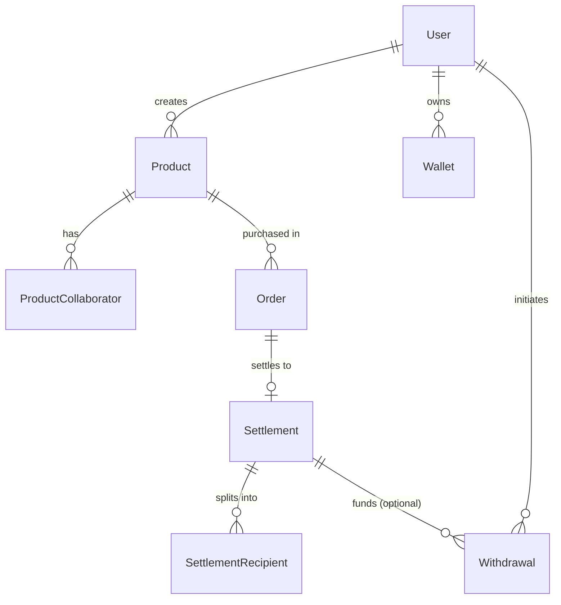

# Entity Relationship Diagram

> ERD visual untuk schema Kreav. Detail field → [`backend/prisma/schema.prisma`](../../backend/prisma/schema.prisma). 9 models, 9 enums, 3 domains.

## Domain overview



## Full entity diagram

```mermaid
erDiagram
    User {
        string id PK "uuid"
        string email UK
        string name
        UserRole role "CREATOR|BUYER|ADMIN"
        datetime createdAt
    }
    Product {
        string id PK
        string creatorId FK
        string title
        string description
        decimal priceUsd "Decimal(18,2)"
        datetime createdAt
    }
    ProductCollaborator {
        string id PK
        string productId FK
        string walletAddress "G..."
        string role "free-text"
        decimal revenuePercentage "Decimal(5,2)"
        CollaboratorStatus status "ACTIVE|INACTIVE"
        datetime createdAt
    }
    Order {
        string id PK "uuid = contract order_ref"
        string productId FK
        string buyerEmail
        decimal amountUsd "Decimal(18,2)"
        OrderStatus status "13-state machine"
        string txHash "nullable"
        string paymentRef "nullable UK"
        datetime createdAt
    }
    Settlement {
        string id PK
        string orderId FK_UK "1:1"
        decimal totalAmount "Decimal(18,2)"
        string txHash
        SettlementStatus status
        datetime createdAt
    }
    SettlementRecipient {
        string id PK
        string settlementId FK
        string walletAddress "G..."
        RecipientType recipientType "CREATOR|PLATFORM (MVP)"
        string role "free-text"
        decimal percentage "Decimal(5,2)"
        decimal amount "Decimal(18,2)"
        datetime createdAt
    }
    Wallet {
        string id PK
        string creatorId FK
        string walletAddress "G... public key ONLY"
        WalletProvider provider "FREIGHTER|LOBSTR"
        datetime connectedAt
    }
    Withdrawal {
        string id PK
        string creatorId FK
        string settlementId FK "nullable"
        string txHash
        decimal amount "Decimal(18,2)"
        WithdrawalStatus status
        datetime createdAt
    }
    NotificationLog {
        string id PK
        string recipient "email"
        NotificationChannel channel "EMAIL"
        string event
        NotificationStatus status
        int attempts
        string lastError "nullable"
        string providerMessageId "nullable"
        datetime createdAt
        datetime updatedAt
    }

    User ||--o{ Product : creates
    User ||--o{ Wallet : owns
    User ||--o{ Withdrawal : initiates
    Product ||--o{ ProductCollaborator : has
    Product ||--o{ Order : "is purchased in"
    Order ||--o| Settlement : settles
    Settlement ||--o{ SettlementRecipient : "splits into"
    Settlement ||--o{ Withdrawal : "may fund"
```

> Detail konvensi + constraint → [Database Bible](./Database-Bible.md)
