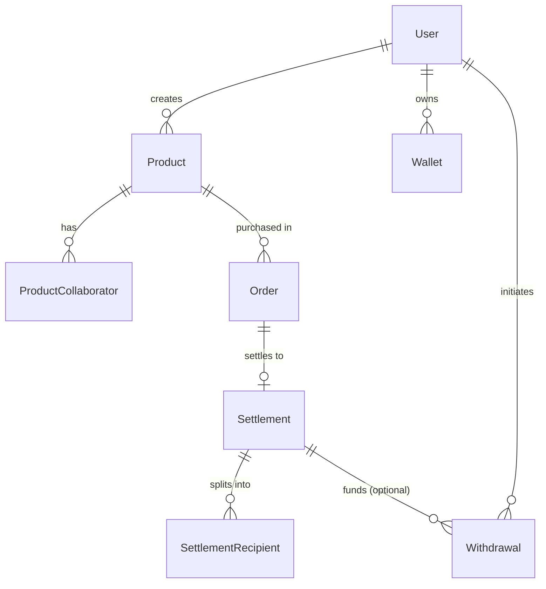

# Entity Relationship Diagram (ERD)

> **Status:** Canonical ERD for the Kreav schema. Matches [`backend/prisma/schema.prisma`](../../backend/prisma/schema.prisma) exactly (9 models, verified).
> **Authoritative refs:** [Backend PRD](../backend/Backend-PRD.md) §20 (Domain Model), [Database Bible](./Database-Bible.md).

## Domain overview

Three domains, no cross-domain coupling beyond explicit relations:



## Full entity diagram

```mermaid
erDiagram
    User {
        string id PK "uuid; = contract order_ref source for its Orders"
        string email UK
        string name
        UserRole role "CREATOR|BUYER|ADMIN (default BUYER)"
        datetime createdAt
    }
    Product {
        string id PK
        string creatorId FK
        string title
        string description
        decimal priceUsd "Decimal(18,2)"
        datetime createdAt
    }
    ProductCollaborator {
        string id PK
        string productId FK "onDelete Cascade"
        string walletAddress "creator's G..."
        string role "free-text"
        decimal revenuePercentage "Decimal(5,2); sum=100% of creator pool"
        CollaboratorStatus status "ACTIVE|INACTIVE"
        datetime createdAt
    }
    Order {
        string id PK "uuid; ADR H2 = contract order_ref"
        string productId FK
        string buyerEmail "no buyer FK (anonymous)"
        decimal amountUsd "Decimal(18,2)"
        OrderStatus status "13-state machine"
        string txHash "nullable; set on settle"
        string paymentRef "nullable UK; idempotency key"
        datetime createdAt
    }
    Settlement {
        string id PK
        string orderId FK_UK "1:1 with Order"
        decimal totalAmount "Decimal(18,2)"
        string txHash "non-null; on-chain proof"
        SettlementStatus status "PENDING|COMPLETED|FAILED"
        datetime createdAt
    }
    SettlementRecipient {
        string id PK
        string settlementId FK "onDelete Cascade"
        string walletAddress "destination G..."
        RecipientType recipientType "CREATOR|PLATFORM (MVP); AFFILIATE|TREASURY reserved"
        string role "free-text"
        decimal percentage "Decimal(5,2)"
        decimal amount "Decimal(18,2)"
        datetime createdAt "ADR H3 (audit #9 fixed)"
    }
    Wallet {
        string id PK
        string creatorId FK
        string walletAddress "G... public key ONLY (non-custodial)"
        WalletProvider provider "FREIGHTER|LOBSTR"
        datetime connectedAt
    }
    Withdrawal {
        string id PK
        string creatorId FK
        string settlementId FK "nullable"
        string txHash
        decimal amount "Decimal(18,2)"
        WithdrawalStatus status "PENDING|COMPLETED|FAILED"
        datetime createdAt
    }
    NotificationLog {
        string id PK
        string recipient "email"
        NotificationChannel channel "EMAIL"
        string event "e.g. settlement.completed"
        NotificationStatus status "PENDING|SENT|FAILED"
        int attempts "default 0"
        string lastError "nullable"
        string providerMessageId "nullable"
        datetime createdAt
        datetime updatedAt "@updatedAt"
    }

    User ||--o{ Product : creates
    User ||--o{ Wallet : owns
    User ||--o{ Withdrawal : initiates
    Product ||--o{ ProductCollaborator : has
    Product ||--o{ Order : "is purchased in"
    Order ||--o| Settlement : settles
    Settlement ||--o{ SettlementRecipient : "splits into"
    Settlement ||--o{ Withdrawal : "may fund"
```

## Enums (9)

| Enum | Values | Notes |
|------|--------|-------|
| `UserRole` | `CREATOR` `BUYER` `ADMIN` | default `BUYER` |
| `WalletProvider` | `FREIGHTER` `LOBSTR` | |
| `CollaboratorStatus` | `ACTIVE` `INACTIVE` | default `ACTIVE` |
| `OrderStatus` | `CREATED` `CHECKOUT_STARTED` `PAYMENT_PENDING` `PAYMENT_RECEIVED` `SETTLEMENT_PENDING` `SETTLED` `WITHDRAW_PENDING` `WITHDRAW_COMPLETED` `PAYMENT_FAILED` `SETTLEMENT_FAILED` `WITHDRAW_FAILED` `WAITING_WALLET` `CANCELLED` | 13 states (8 lifecycle + 5 failure) |
| `SettlementStatus` | `PENDING` `COMPLETED` `FAILED` | |
| `RecipientType` | `CREATOR` `PLATFORM` `AFFILIATE` `TREASURY` | MVP uses CREATOR + PLATFORM only |
| `WithdrawalStatus` | `PENDING` `COMPLETED` `FAILED` | |
| `NotificationChannel` | `EMAIL` | |
| `NotificationStatus` | `PENDING` `SENT` `FAILED` | |

## Key relationships explained

- **Order → Settlement is 1:1** (`Settlement.orderId @unique`). One order settles in exactly one on-chain transaction.
- **Settlement → SettlementRecipient is 1:N** (ADR-006). The "1 + N" accounting model.
- **Order has no buyer FK** — `buyerEmail` only (buyers anonymous in MVP; audit #8, a known decision).
- **Wallet stores only the public key** — non-custodial (ADR-002); no secret columns anywhere.

---

*Cross-reference: conventions + constraints → [Database Bible](./Database-Bible.md); changing the schema → [Migration Guide](./Migration-Guide.md).*
