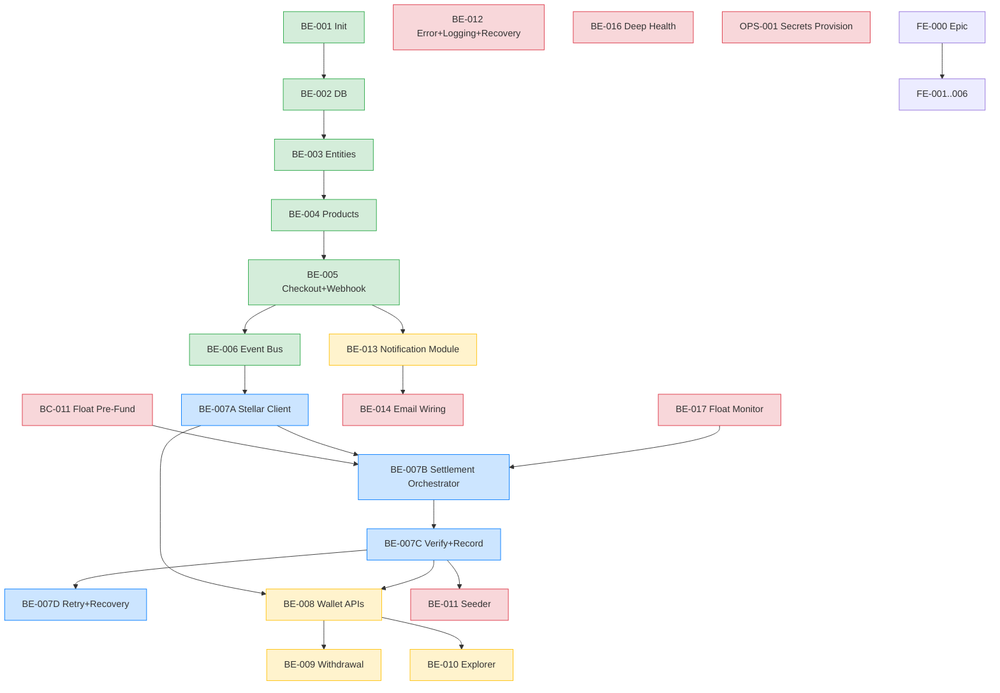

# Issue Backlog Review & Refactor

> **Role:** Engineering Program Manager + Principal Architect.
> **Scope:** review every GitHub Issue against the (now-mature) documentation, then bring the issues into alignment. **Documentation is immutable and authoritative; issues are the artifact to fix.**
> **Authority:** `docs/` > existing issue text. On conflict, docs win.
> **Date:** 2026-06-27.

---

# 1. Issue Review Report

## 1.1 Current state (as gathered)

| # | Issue | State | Sprint | Verdict |
|---|-------|-------|--------|---------|
| 1 | BE-001 Initialize Backend | ✅ Closed | S1 | Valid — shipped (PR #15) |
| 2 | BE-002 Database Setup | ✅ Closed | S1 | Valid — shipped (PR #16, #18) |
| 3 | BE-003 Core Entities | ✅ Closed | S1 | Valid — shipped (PR #29). Title stale ("Transaction" — model was renamed in v3.1; body fine). |
| 4 | BE-004 Product APIs | ✅ Closed | S2 | Valid — shipped (PR #31) |
| 5 | BE-005 Checkout APIs | ✅ Closed | S2 | Valid — shipped (PR #32) |
| 6 | BE-006 Event Bus | ✅ Closed | S2 | Valid — shipped (PR #32) |
| 7 | BE-007 Settlement Service | 🟢 Open | S2 | **Valid, but REFINE** — largest/stakest backend task; references stale doc paths + stale terms; needs split decision + RPC-primary correction. |
| 8 | BE-008 Wallet APIs | 🟢 Open | S3 | **Refine** — references stale `Transaction` table + old doc paths. |
| 9 | BE-009 Withdrawal APIs | 🟢 Open | S3 | **Refine** — implies real on-chain creator→treasury transfer which is **not** the MVP model (mock anchor; float). Needs correction. |
| 10 | BE-010 Explorer Integration | 🟢 Open | S3 | Valid — tiny, refine paths. |
| 11 | BE-011 Demo Data Seeder | 🟢 Open | S4 | **Refine** — references stale terms; add idempotency-on-multi-unique note (audit #14). |
| 12 | BE-012 Error Handling | 🟢 Open | S4 | **Refine** — error codes must align with `docs/api/Error-Codes.md` (net-new catalog); add startup-recovery-job scope. |
| 20 | BE-013 Notification Module | 🟢 Open | S3 | Valid — refine paths; align retry with Error-Codes. |
| 21 | BE-014 Email Event Wiring | 🟢 Open | S4 | Valid — refine paths. |
| 13 | "coba belajar git" | 🟢 Open | none | **Obsolete — close** (test/sandbox issue, no value). |
| 22–28 | FE-001–FE-006 + FE-000 epic | 🟢 Open | none | Frontend track — out of backend agent scope. Reviewed for dependency notes only; left to FE team. |

## 1.2 Per-issue required changes (summary)

| Issue | Required changes |
|-------|------------------|
| #3 BE-003 (closed) | Title still says "Transaction" — cosmetic; no action (closed). |
| #7 BE-007 | **Split recommended** (BE-007A–D) — it's ~8h of high-stakes work bundling 4 separable concerns. Rewrite to RPC-primary (`getAccount→simulate→assemble→sign→poll`), float-aware, `order_ref=Order.id`, mirror-not-recompute, new doc paths. |
| #8 BE-008 | Remove stale "Transaction table" (→ Settlement + Withdrawal); doc paths; reuse `HorizonService`. |
| #9 BE-009 | **Correct the on-chain model** — MVP withdrawal is **mocked** (no real creator→treasury transfer in the demo); align with Anchor PRD + the float model (C1). |
| #10 BE-010 | Doc paths; align with explorer URL in API-Standards. |
| #11 BE-011 | Doc paths; idempotency on multi-unique (audit #14); add `createdAt` to SettlementRecipient (H3) note. |
| #12 BE-012 | Align error codes with `docs/api/Error-Codes.md`; **add startup recovery job** (audit #18) to scope; doc paths. |
| #13 | Close (obsolete test). |
| #20 BE-013 | Doc paths; retry references Error-Codes. |
| #21 BE-014 | Doc paths. |

---

# 2. Updated Issue Descriptions

All open backend issues (#7–#12, #20, #21) are rewritten with a **single consistent template** and applied to GitHub in the next step. The template:

```
### Overview
### Why
### Scope
### Out of Scope
### Technical Notes
### Dependencies
### Acceptance Criteria   (measurable, no "works")
### Testing Requirements
### Documentation References  (relative paths into docs/)
```

Full bodies are applied via `gh issue edit` (see §execution). They are not duplicated here — they live on the issues themselves.

## Split recommendation: BE-007

BE-007 bundles ~8h of the highest-stakes work. **Splitting improves implementability** (each piece is independently testable/reviewable, and BE-007C/D can parallelize once A/B land). Recommended sub-issues (created as new issues, BE-007 kept as the epic/umbrella):

| New | Title | Scope | Why separate |
|-----|-------|-------|--------------|
| **BE-007A** | Stellar RPC + Horizon Client Abstraction | `src/stellar/` RPC client (invoke pattern), Horizon client (balance/trustline), env wiring. | Pure infra; no money logic; reusable by 007B/C + BE-008/009. |
| **BE-007B** | Settlement Orchestrator (event→invoke) | Consume `payment.received`, pre-checks (wallet/trustline/shares), build recipients, invoke `settle` via 007A, emit `settlement.completed`. | The "wow" logic; depends on 007A. |
| **BE-007C** | Settlement Verification + Recorder | Poll `getTransaction`, mirror return value → 1 Settlement + N SettlementRecipient (atomic `$transaction`), Order→SETTLED. | Verification is a distinct concern; can be reviewed/tested alone. |
| **BE-007D** | Settlement Retry & Recovery | Verify-only retries (not re-invoke), startup recovery job (audit #18), idempotency guard. | Cross-cutting reliability; the double-settle guard lives here. |

(Only split where it helps. BE-008–014 stay single issues.)

---

# 3. New Issue List (gaps from docs)

Comparing `docs/` against the backlog, these documented items have **no issue**. Only genuinely-missing, doc-backed work:

| New ID | Title | Sprint | Doc basis | Why missing |
|--------|-------|--------|-----------|-------------|
| **BC-011** | Platform USDC Float Pre-Funding | S1 (do before demo) | [ADR C1](../reviews/Final-Architecture-Review.md), ED-9, [Demo Checklist](../demo/Demo-Checklist.md) | The funding gap was undocumented; now a P0 demo prerequisite. **Already in Implementation-Backlog.md doc** — needs a matching GitHub issue. |
| **BE-015** | Domain Exception Hierarchy + Global Exception Filter | S4 | [Error-Codes](../api/Error-Codes.md), audit #12, [Coding Standards §7](../engineering/Coding-Standards.md) | The exception hierarchy that *emits* the Error-Codes catalog — currently bundled into BE-012; extracting clarifies ownership. *(Recommend: keep in BE-012 rather than split — noted as a candidate, not created unless BE-012 is split.)* |
| **BE-016** | Deep Health Endpoint (`/health` ready = SELECT 1) | S4 | audit #15, [Deployment PRD §13](../backend/Deployment-PRD.md), [Observability PRD §8](../backend/Observability-PRD.md) | Split from BE-012; small, deploy-blocking. **Create.** |
| **BE-017** | Platform Float Balance Monitor | S4 | [Observability PRD §9](../backend/Observability-PRD.md), [ADR C1](../reviews/Final-Architecture-Review.md) | Low-float alerting — demo reliability. **Create.** |
| **OPS-001** | Production Secrets Provisioning (PLATFORM_WALLET_SECRET + GCASH_WEBHOOK_SECRET) | S4/pre-demo | [Deployment PRD §9](../backend/Deployment-PRD.md), [Security PRD §16](../security/Security-PRD.md), H1 | Provisioning the two secrets is an ops task, not code. **Create.** |

> No invented features: every new issue traces to a documented decision/ADR/audit finding.

---

# 4. Issue Dependency Graph



**Critical path to the demo:** BE-001→002→003→004→005→006 → **007A→007B→007C** → 008→009 → 011(seeder) → demo. BE-010/012/013/014/016/017/OPS-001/BC-011 run in parallel where the graph allows.

---

# 5. Recommended Sprint Plan

| Sprint | Theme | Issues (in execution order) |
|--------|-------|------------------------------|
| **S1 — Foundation** ✅ | skeleton + DB | BE-001, BE-002, BE-003 *(done)* · **BC-011** (float — do before demo, can start now) |
| **S2 — Core Flow** | purchase → settlement | BE-004, BE-005, BE-006 *(done)* · **BE-007A** (Stellar client) → **BE-007B** (orchestrator) → **BE-007C** (verify+record) → **BE-007D** (retry+recovery) |
| **S3 — Wallet & Withdrawal** | creator experience | **BE-008** (wallet APIs) → **BE-009** (withdrawal) · **BE-010** (explorer) · **BE-013** (notification module) |
| **S4 — Demo Hardening** | ship-ready | **BE-012** (error+logging+recovery) · **BE-016** (deep health) · **BE-017** (float monitor) · **OPS-001** (secrets) · **BE-011** (seeder) · **BE-014** (email wiring) |
| **Parallel / anytime** | | FE-001..006 (frontend track) |

> BC-011, BE-016, BE-017, OPS-001 are **new** (gap issues). All others are existing issues, reordered/refined.

---

# 6. Gap Analysis (documented but no issue)

| Documented item | Doc reference | Issue status |
|-----------------|---------------|--------------|
| Platform USDC float pre-funding | ADR C1, ED-9, BC-011 in Backlog doc | **Missing GitHub issue** → create BC-011 |
| Deep `/health` readiness (SELECT 1) | audit #15, Deployment §13, Observability §8 | **Missing** → create BE-016 |
| Platform float balance monitor | Observability §9, ADR C1 | **Missing** → create BE-017 |
| Secrets provisioning (PLATFORM_WALLET_SECRET, GCASH_WEBHOOK_SECRET) | Deployment §9, Security §16, H1 | **Missing** → create OPS-001 |
| Startup recovery job (stuck PAYMENT_RECEIVED/SETTLEMENT_PENDING) | audit #18, Runtime Flow §15 | **In BE-012 scope** (added explicitly in its rewrite) |
| Domain exception hierarchy (emits Error-Codes catalog) | Error-Codes, Coding Standards §7, audit #12 | **In BE-012 scope** (added explicitly) |
| `order_ref = Order.id` mapping | ADR H2, Soroban Contract §0 | **In BE-007B scope** (added) |
| `SettlementRecipient.createdAt` migration | ADR H3, audit #9 | **In BE-007C scope** (added — `migrate dev --name settlement_recipient_created_at`) |
| OpenAPI spec generation | API-Standards, Versioning | **Not MVP** (intentional gap — documented as post-MVP in Governance-Layer-Report) |
| SonarCloud project-key rename | AGENTS.md, Final Review | **Owner action** (ahmadUffi) — not an engineering issue |

**No documented feature is missing an issue.** The 4 new issues (BC-011, BE-016, BE-017, OPS-001) close every actionable gap; the rest are scoped into existing issues.

---

# 7. Final Verdict

### Is the issue backlog implementation-ready?
**After the applied updates: YES.** Every open backend issue will carry a consistent template, measurable acceptance criteria, correct dependencies, accurate doc references (post-refactor paths), and the correct Stellar/MVP model (RPC-primary, float-aware, mock-anchor, mirror-not-recompute). The gaps are closed by 4 new issues.

### What blockers remain before BE-007?
1. **BC-011 (platform float)** must be done or at least in-flight — the `settle` contract draws from the platform account; without USDC there, every settlement reverts.
2. **The Soroban split contract must be deployed** (BC-004/005) and `SPLIT_CONTRACT_ID` known — BE-007B invokes it.
3. **`PLATFORM_WALLET_SECRET`** must be provisioned (OPS-001) for BE-007B to sign.
4. Schema migration for `SettlementRecipient.createdAt` (H3) — run in the BE-007C branch.

### Is the backlog consistent with all architecture documents?
**Yes, post-update.** The rewrites remove every stale term (`Transaction` table, `Treasury`, old doc paths) and align each issue with: the 8 ADRs, the ED table, the Error-Codes catalog, the state machine, the float model (C1), `order_ref` (H2), non-custodial (ADR-002), and the mock-anchor boundary (ADR-008).

### What must NOT happen
- No code modified (this is a backlog review only).
- No documentation modified (docs are immutable here).
- No issue auto-closed except the obsolete #13.

---

*Execution of the updates (issue edits + new issues + #13 closure) follows this report.*
