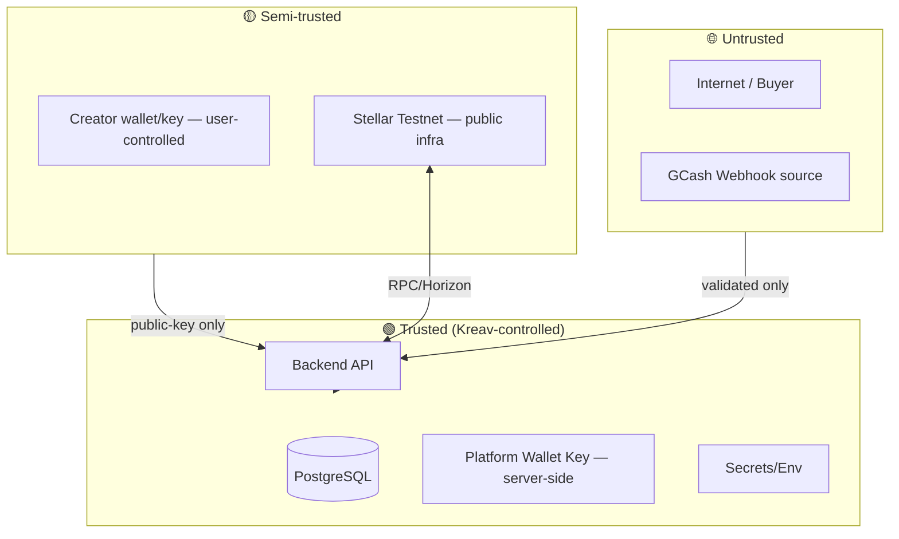

# Kreav Security PRD

> **Status:** Security **design** document (not an audit). Defines the threat model, trust boundaries, and controls for every component. The companion `docs/security/Security-Audit.md` tracks the *status* of specific findings; this PRD defines the *intended* posture.
> **Authority on conflict:** Official Stellar docs (soroban skill Part 3) → Architecture Consistency Check → Kreav Backend PRD v3.1 → this document. The `docs/security/Security-Audit.md` findings map onto the controls here.
> **Scope:** the backend + its integrations (RPC, Horizon, anchor, wallet). Frontend/contract security referenced where they meet the backend.

---

## 1. Threat Model

**Core assumption (from the soroban skill Part 3 "Core Principle"):** assume the attacker controls all arguments, transaction ordering, and all accounts except those requiring signatures — and can deploy contracts mimicking our interface.

**Primary assets:**
- **Money** — USDC flowing through the split (buyer funds → creator/platform).
- **The platform wallet key** — sole signer of settlements; compromise = ability to invoke the contract / move buyer funds.
- **Settlement integrity** — a split must happen exactly once per payment; never double, never partial, never to the wrong recipient.
- **Creator trust** — non-custodial promise: we never hold their keys/funds.

**Primary adversaries:**
- **Forged-payment attacker** — POSTs a fake GCash webhook to trigger settlement without paying.
- **Replay attacker** — resends a valid webhook to double-settle.
- **Key-thief** — exfiltrates the platform wallet key or a creator key.
- **Rogue-issuer attacker** — tricks a creator into trusting a malicious USDC-like asset.
- **Supply-chain attacker** — injects malicious dependency updates.

---

## 2. Trust Boundaries

**Boundary rules:**
- **Untrusted → API:** every byte validated (DTO `whitelist` + `forbidNonWhitelisted`); no implicit trust of headers/bodies.
- **Creator → API:** only the public key crosses; the secret key **never** enters Kreav's systems (non-custodial).
- **Testnet ↔ API:** Testnet is public/semi-trusted — RPC responses are verified (success/return value), not blindly trusted.
- **Within Trusted:** the platform key is isolated to the SettlementService; not sprawled across modules.

---

## 3. Authentication

**MVP:** buyers are anonymous (no auth — tracked by `orderId` + `buyerEmail`). Creators authenticate by *wallet connection* (prove they control a `G...`).

**Why no username/password in MVP:** the demo has no persistent buyer accounts; adding auth is cost without demo value. SEP-10 wallet auth is the post-MVP path for creator sessions (§5).

---

## 4. Authorization

**Principle:** least privilege per module.

| Operation | Authorized by |
|-----------|---------------|
| `POST /products` (create) | creatorId in body (MVP no session — validated) |
| `POST /checkout` | anyone (buyer, anonymous) |
| `POST /wallet/connect` | the creator owning the wallet (public-key match) |
| `POST /wallet/withdraw` | the creator owning the wallet |
| **Contract `settle`** | **platform account only** (`require_auth` + server-side key) |
| **Contract `set_platform_fee_bps`** | admin only |

**Why the platform is the sole contract signer:** settlement must fire autonomously on payment; it can't wait for creator co-sign. This concentrates authority in one key — see §16 for its protection. Creators never authorize settlements; they only receive.

---

## 5. JWT

**MVP: none.** Post-MVP: SEP-10 (wallet auth) → the anchor issues a JWT after the creator signs a challenge; Kreav's backend validates that JWT for creator sessions.

**Why deferred:** the demo trust model doesn't need it; wallet public-key match suffices for MVP. Introducing JWT before SEP-10 would mean inventing an ad-hoc scheme the official standard would later replace.

---

## 6. Wallet Authentication

**Mechanism (MVP):** the creator connects Freighter/Lobstr; the frontend sends the **public key** to the backend. No challenge-response in MVP (the wallet's connection itself implies control).

**Post-MVP (SEP-10):** the backend (or anchor) sends a challenge transaction; the creator signs it; signature verified → session established. This proves key ownership cryptographically.

**Why MVP is lighter:** acceptable demo risk; SEP-10 is the production-grade replacement (Stellar Standards §10).

---

## 7. Webhook Verification

**Control:** HMAC-SHA256 over the **raw body** (audit #11). The `X-Gcash-Signature` header carries the HMAC; `WebhookSignature.verify` does a **timing-safe** comparison.

**Dev escape hatch:** if `GCASH_WEBHOOK_SECRET` is unset, verification passes but a **warning is logged** — so dev/CI aren't blocked, but the on-stage demo MUST set the secret. Without it, anyone who knows an `orderId` could forge a payment and force settlement.

**Why raw body, not parsed:** HMAC is over the exact bytes the sender produced; JSON re-serialization changes whitespace → signature mismatch. NestJS `rawBody: true` exposes `req.rawBody`.

**Why timing-safe:** a naive `===` leaks byte-by-byte timing, enabling signature forgery over many requests.

---

## 8. Replay Attack Protection

**Controls:**
- **Idempotency key (`paymentRef`)** — a duplicate webhook is detected before any state change (Sequence Bible §22). The DB UNIQUE on `Order.paymentRef` (audit #5) makes it impossible to bind one payment to two orders.
- **Contract `order_ref` guard** — the Soroban contract rejects a duplicate `settle` for the same `order_ref` (Soroban Contract PRD §9).
- **Webhook freshness** — (recommended) a timestamp/nonce in the signed payload, rejected if too old.

**Defense in depth:** backend check → DB constraint → contract guard. Bypassing one is insufficient.

---

## 9. CSRF

**MVP:** low concern — the API is JSON + Authorization-based, not cookie-session-based. POST endpoints require explicit JSON bodies, which cross-origin forms can't forge with a correct Content-Type.

**Post-MVP:** if cookie sessions are added (with SEP-10 JWT in a cookie), enforce `SameSite` + a CSRF token. Not needed while auth is header-based.

---

## 10. Rate Limiting

**Control:** `@nestjs/throttler` global guard (100/min default). Tighter per route:
- `POST /checkout`: 20/min
- `POST /webhooks/gcash`: 10/min
- `POST /wallet/withdraw`: (add throttling on implementation)

**Why:** prevents brute-force/forgery attempts and GCash-replay floods from overwhelming settlement. In-memory storage in MVP (per-instance); Redis store if scaled horizontally (Deployment PRD §21).

---

## 11. Input Validation

**Controls:**
- `ValidationPipe` with `whitelist` (strip unknown), `transform` (coerce), `forbidNonWhitelisted` (reject unknown → 400).
- DTO constraints: `priceUsd` decimal-string regex (≤2 decimals, non-negative); `paymentRef` non-empty; UUIDs validated; pagination bounded (`limit ≤ 100`).
- Money never accepted as a JS number (precision); always a decimal string → `Prisma.Decimal`.

**Why `forbidNonWhitelisted`:** mass-assignment protection — an `evil: true` field can't smuggle through.

---

## 12. Output Encoding

- **JSON responses** via NestJS serializer (no manual concatenation → no injection).
- The `DecimalToStringInterceptor` ensures money outputs are strings ("10.00"), not internal objects.
- Explorer links built from constants + validated txHash (no user-controlled URL composition).

---

## 13. Secrets Management

**Rules:**
- `.env` is gitignored (root + backend). `.env.example` is the template (placeholders only).
- Production secrets live in Railway (encrypted at rest), injected as env.
- **No secret in code, logs, error messages, or commits.** A pre-commit grep check (Testing PRD §19) guards this.
- Rotation: the platform key + GCash secret are rotatable (env-driven, no code change).

---

## 14. Environment Security

- `NODE_ENV=production` enforces prod mode (no stack traces leaked in errors).
- Joi validates env at boot (Runtime Flow Bible §9) — fail fast on malformed config.
- The `GCASH_WEBHOOK_SECRET` optional-in-dev / required-in-prod split is explicit and logged.

---

## 15. Private Key Protection

**Rule:** Kreav stores **zero** creator private keys (non-custodial — resolved contradiction). The only key the backend holds is the **platform wallet key** (§16).

**Why zero creator keys:** a backend holding N creator keys is a centralized honeypot — the exact failure non-custodial design prevents. The Stellar Skills' wallet model is non-custodial by default; Kreav aligns with it.

---

## 16. Platform Wallet Security

**The single highest-value secret — `PLATFORM_WALLET_SECRET` (ADR H1, Stellar Standards ED-10).** It signs every settlement transaction. Controls:
- **Server-side only** — held as the `PLATFORM_WALLET_SECRET` env var (Railway, encrypted at rest); never in git, never logged, never in error responses.
- **Least privilege** — accessible only to the SettlementService; not a global.
- **Rotatable** — env-driven; rotation = update the secret + redeploy (the contract's authorized `source` address must match, so rotation may need a contract admin op).
- **Audited access** — the SettlementService logs every invocation (with `orderId`/`txHash`), so platform-key use is observable.

**Pre-funded USDC float (ADR C1):** this same account holds the **pre-funded testnet USDC float** the `settle` contract draws from (Implementation Backlog BC-011). The float balance is a monitored signal (Observability PRD §9) — depletion → `settle` reverts → `SETTLEMENT_FAILED`. Production replaces the float with a real on-ramp that credits the account.

**Why this is acceptable non-custodially:** the key moves *buyer* funds per the split — never *creator* funds. Creators' wallets only receive. The risk is "attacker invokes the contract," mitigated by key protection + the contract's input validation (shares sum, asset allowlist, `order_ref` idempotency).

---

## 17. Database Security

- **Connection:** single `DATABASE_URL` (Railway managed Postgres, TLS).
- **Credentials:** Railway-managed; rotated via Railway.
- **Money columns:** `Decimal(18,2)` — never float.
- **Constraints as security:** `Order.paymentRef` UNIQUE (idempotency), FKs RESTRICT/CASCADE (referential integrity), enum types constrain state.
- **Least-privilege DB user:** (recommended) the app uses a role limited to Kreav tables, not superuser.

---

## 18. Encryption

- **In transit:** TLS everywhere (Railway proxy, Postgres connection, RPC/Horizon HTTPS).
- **At rest:** Railway managed DB encryption; secrets encrypted in Railway.
- **Application-level:** not needed in MVP (no field-level secrets beyond the platform key, which is env-protected).

---

## 19. PII Handling

**What Kreav collects:** email (creator/buyer), name (creator), wallet public key, country (persona). **No government IDs, no bank details** (KYC lives at the anchor — Anchor PRD §10).

**Rules:**
- Email/name stored in Postgres; never logged at `error` level.
- Wallet public key is not PII-sensitive (it's public by definition).
- Bank details: **never collected by Kreav** (the anchor holds them).
- MVP: no data-retention policy automation; production needs a deletion/GDPR flow (future roadmap).

---

## 20. Logging Rules

- **Always log:** event names, orderId, txHash, amounts, status transitions.
- **Never log:** secret keys, seed phrases, `GCASH_WEBHOOK_SECRET`, full tokens, PII at error level.
- **Redact:** if a payload could contain a secret, redact before logging.
- **Correlation:** every line carries `requestId` (Observability PRD §3).

---

## 21. Dependency Management & Supply Chain

- **Lockfile:** `pnpm-lock.yaml` + `--frozen-lockfile` in CI (deterministic installs).
- **CVE scanning:** `pnpm audit` in CI (audit #1 fixed multer; js-yaml residual accepted — dev-only).
- **Major-version bump check:** recommended (audit #16) — reject surprise major bumps in PRs.
- **Overrides:** `pnpm-workspace.yaml` `overrides` for transitive CVEs (e.g., multer).

**Why:** a malicious/buggy dependency is a primary supply-chain vector. The lockfile + audit + override chain is the MVP control set.

---

## 22. Docker Security

- **Multi-stage build** (runtime image minimal).
- **Non-root user** in the runtime container.
- **No secrets baked into images** (env at runtime).
- **Pinned base image** (tag, not `latest`).

---

## 23. RPC Security

- **Verify responses:** `getTransaction` status checked explicitly; `returnValue` mirrored (not trusted blindly).
- **7-day window awareness:** verification runs immediately (within the window).
- **Endpoint trust:** `SOROBAN_RPC_URL` is a trusted Testnet endpoint (config-validated).

---

## 24. Anchor Security

- **MVP mock:** no real value moves; the mock can't steal funds (it moves nothing).
- **Real anchor (future):** SEP-10 auth (the creator authenticates to the anchor directly); Kreav never proxies creator credentials. KYC/bank data stays at the anchor (§19). Kreav validates the anchor's callbacks but treats balance truth as Horizon, not the anchor's claim.

---

## 25. Soroban Security (contract-side, governs the integration)

Per the soroban skill Part 3 checklist (Soroban Contract PRD §9). The backend's reliance:
- **`require_auth` on `settle`** — only the platform account can invoke (we rely on this; we are that account).
- **USDC SAC allowlist** — the contract rejects non-USDC assets (we rely on this for asset integrity).
- **Checked arithmetic + shares-sum validation** — the contract enforces the split authoritatively (we mirror, don't recompute).
- **Single-init guard, typed storage keys, TTL extension** — contract-internal; we assume a correctly-deployed contract.

---

## 26. OWASP API Top 10 Mapping

| OWASP API (2019) | Kreav control |
|------------------|---------------|
| API1 Broken Object Level Auth | creatorId ownership checks; (post-MVP: SEP-10 sessions) |
| API2 Broken Auth | wallet public-key match; (post-MVP: SEP-10 JWT) |
| API3 Excessive Data Exposure | DTO `whitelist`; no secret fields in responses |
| API4 Lack of Resources & Rate Limiting | `@nestjs/throttler` global + per-route |
| API5 Broken Function Level Auth | contract `require_auth`; admin-only fee change |
| API6 Mass Assignment | `forbidNonWhitelisted` ValidationPipe |
| API7 Security Misconfiguration | Joi env validation; Helmet; CORS allowlist |
| API8 Injection | Prisma parameterized queries; no raw SQL; structured JSON output |
| API9 Improper Assets Management | inventory: 1 contract (`settle`); documented endpoints |
| API10 Insufficient Logging | structured logs + event log + `requestId` correlation |

---

## 27. Security Checklist (implementation gate)

- [ ] HMAC webhook verification (audit #11) — ✅ done (BE-005)
- [ ] Rate limiting on checkout/webhook/withdraw (audit #7) — ✅ done (BE-005)
- [ ] `paymentRef` idempotency + UNIQUE (audit #5) — ✅ done (BE-003/005)
- [ ] Decimal→string serialization (audit #10) — ✅ done (BE-004)
- [ ] Graceful shutdown (audit #2) — ✅ done
- [ ] Helmet + CORS (audit #4) — ✅ done
- [ ] Startup recovery job (audit #18) — 🔜 BE-012
- [ ] Domain exception hierarchy (audit #12) — 🔜 BE-012
- [ ] Deep health check `SELECT 1` (audit #15) — 🔜
- [ ] Pre-demo wallet pre-funding + trustline (audit #21) — 🔜 BE-011
- [ ] Platform USDC float pre-funding + low-float alert (ADR C1) — 🔜 BC-011
- [ ] `PLATFORM_WALLET_SECRET` provisioned server-side (ADR H1) — 🔜 BC-011 / deploy
- [ ] Testnet reliability contingency (audit #20) — 🔜 pre-demo
- [ ] `no-explicit-any: error` for financial code (audit #17) — 🔜

---

## 28. Future Security Roadmap

| Item | When | Why |
|------|------|-----|
| SEP-10 wallet auth (JWT sessions) | Post-MVP | cryptographic creator auth |
| Pre-commit secret scan | Post-MVP | prevent secret commits |
| Deep readiness health + alerting | Post-MVP | operational |
| Prometheus + alerting | Post-MVP | reliability SLOs |
| OpenTelemetry tracing | Post-MVP | cross-boundary incidents |
| Rate-limit Redis store | On horizontal scale | global limits |
| Contract formal verification (Scout/Certora) | Pre-production | the contract is the trust root |
| GDPR/deletion flow | Production PII | compliance |
| Real-anchor SEP-12 KYC boundary | Real off-ramp | the anchor owns KYC, not Kreav |

---

*Cross-reference: audit finding status → `docs/security/Security-Audit.md`; the controls in action → **Kreav Sequence Diagram Bible**; logging rules → **Kreav Observability PRD**; deploy-time secrets → **Kreav Deployment PRD**.*
