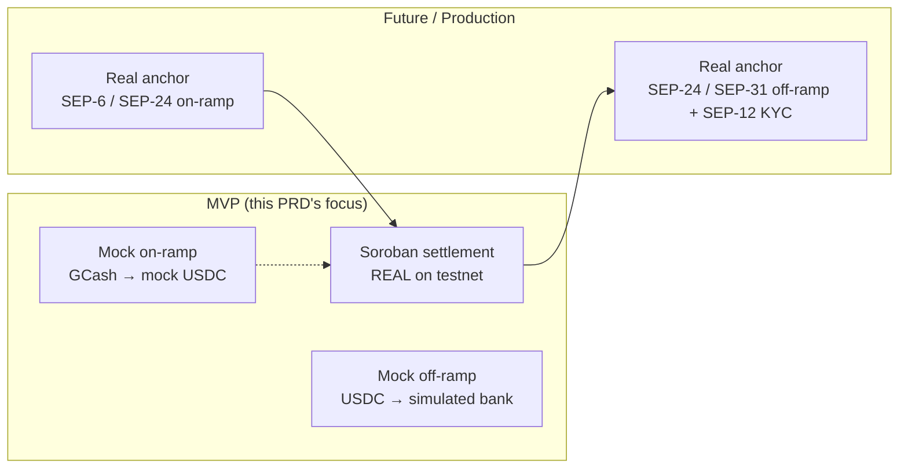
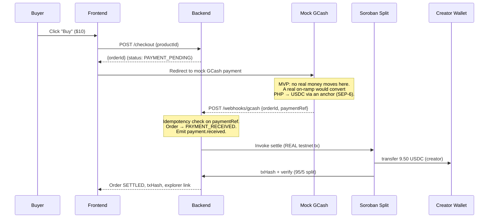
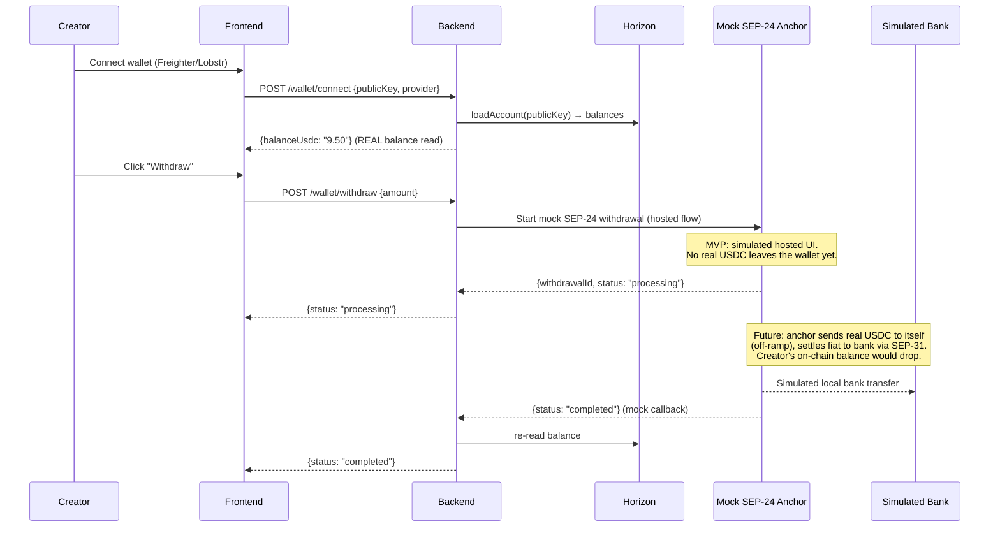
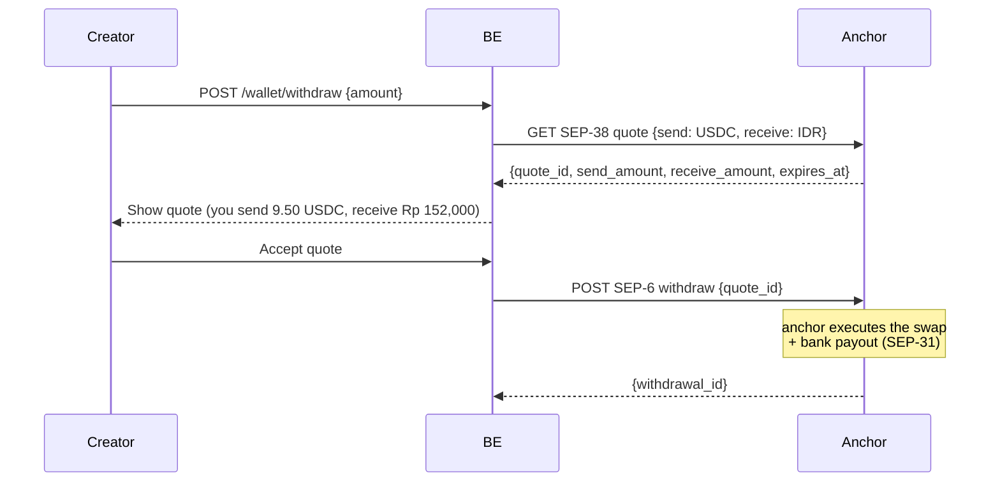
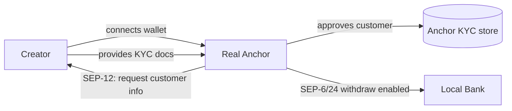
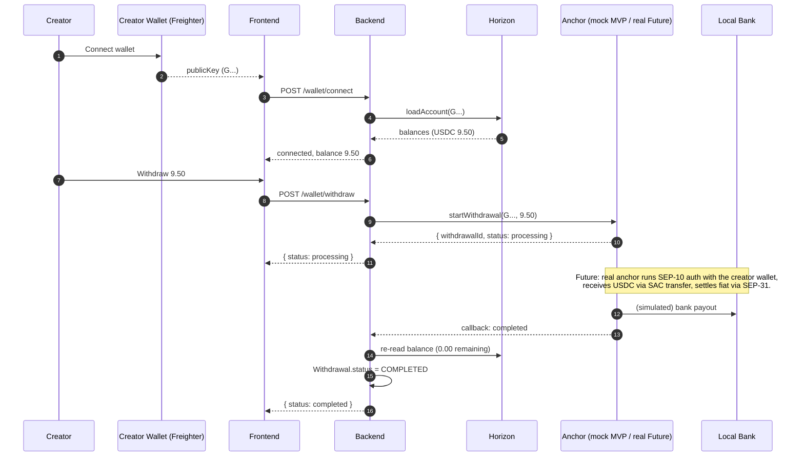

# Kreav Anchor PRD

> **Status:** Complete design document for Kreav's fiat on-ramp / off-ramp architecture.
> **Scope boundary:** This PRD covers the **fiat↔Stellar bridge (anchor)** flows. The *settlement* itself (Soroban split) is owned by the **Soroban Contract PRD**; the Stellar standards/SDKs by the **Stellar Standards PRD**. The NestJS data model + APIs are owned by the **Kreav Backend PRD**.
> **Authority:** Written against the official [Stellar Skills](https://skills.stellar.org) corpus — primarily the [standards](https://github.com/stellar/stellar-dev-skill/blob/main/skills/standards/SKILL.md) and [assets](https://github.com/stellar/stellar-dev-skill/blob/main/skills/assets/SKILL.md) skills. Where the Stellar anchor model (SEP-6/SEP-24/SEP-31) is invoked, the official SEP definitions are followed.

---

## 0. Key context (read first)

1. **Non-custodial.** Kreav never holds creator funds or keys (resolved in Stellar Standards PRD §0). The anchor is a **third party** the creator interacts with; Kreav is an orchestrator, not a counterparty.
2. **MVP = mocked anchor.** The Architecture diagram labels the anchor node **"Mock SEP-24 Anchor."** On-ramp (buyer) is fully mocked (GCash). Off-ramp (creator) is *simulated*. Real anchor integration is **Future** scope.
3. **No KYC in MVP** (Product Scope non-goal). Real anchors require SEP-12 KYC — that is a hard prerequisite for production off-ramp and is documented as Future.
4. **Settlement ≠ off-ramp.** Settlement (buyer's USDC split into the creator's wallet) is *always real* on testnet. Off-ramp (creator's wallet USDC → local bank) is what the anchor does — and that's mocked in MVP.

---

## 1. Anchor Overview

### What problem anchors solve

A Stellar **anchor** is a regulated on/off-ramp: a bridge between Stellar (USDC) and a local payment rail (bank, e-wallet, GCash). Anchors let real-world money enter and leave the Stellar network. Per the `standards` skill, anchors expose SEP interfaces (SEP-6 API-first, SEP-24 hosted UI, SEP-31 sending rails) so wallets and apps can drive deposit/withdrawal flows without each building bespoke bank integrations.

In Kreav's two-sided creator economy:

| Ramp direction | Who needs it | What the anchor does |
|----------------|--------------|----------------------|
| **On-ramp** (fiat → Stellar) | Buyer (e.g. Filipino buyer paying via GCash) | Converts local-currency payment into the USDC that funds the purchase |
| **Off-ramp** (Stellar → fiat) | Creator (e.g. Indonesian creator cashing out) | Converts the USDC in the creator's wallet into local bank currency |

### Kreav's anchor stance



**MVP:** the on-ramp and off-ramp are **simulated**; only the settlement in the middle is real. This isolates the "wow moment" (verifiable on-chain split) from the parts that require bank/KYC plumbing.

---

## 2. Buyer Flow (On-ramp)

> The buyer is the party paying for a digital product. MVP: a Filipino buyer using **GCash (mocked)**.



### Every step explained

| Step | What happens | Real or mock (MVP) |
|------|--------------|--------------------|
| 1. Buyer clicks Buy | Frontend calls `POST /checkout` → backend creates Order at `PAYMENT_PENDING` | Real (backend) |
| 2. Redirect to GCash | Frontend sends buyer to the (mock) GCash payment page | **Mock** — no real PHP moves; a real on-ramp would route through a SEP-6 anchor converting PHP→USDC |
| 3. GCash webhook | Mock GCash POSTs `/webhooks/gcash {orderId, paymentRef}` → backend marks `PAYMENT_RECEIVED`, emits `payment.received` | **Mock** webhook (HMAC signature is still verified — see Backend PRD audit #11) |
| 4. Settlement | Backend invokes the Soroban split contract → **real testnet USDC** split 95/5 | **Real** |
| 5. Creator wallet | Creator receives 9.50 USDC in their wallet | **Real** (testnet USDC) |
| 6. Verification | Backend verifies tx via RPC, returns txHash + explorer link | **Real** |

> **Why the on-ramp is mocked:** a real on-ramp (GCash PHP → USDC) requires a regulated Philippine anchor + KYC + bank rails — all out of MVP scope. Mocking it lets the demo show the *settlement* (the part Kreav owns) end-to-end. The webhook signature is still verified for security honesty.

---

## 3. Creator Flow (Off-ramp / Withdrawal)

> The creator is the party receiving revenue and optionally cashing out. MVP: an Indonesian creator withdrawing USDC to a (simulated) local bank.



### Every step explained

| Step | What happens | Real or mock (MVP) |
|------|--------------|--------------------|
| 1. Connect wallet | Creator connects Freighter/Lobstr; backend stores **public key only** | Real (non-custodial) |
| 2. Balance read | `GET /wallet/balance` → Horizon `loadAccount` → real USDC balance | **Real** (testnet balance) |
| 3. Withdraw | `POST /wallet/withdraw` → backend starts a **mock SEP-24** hosted flow | **Mock** (no real USDC moves) |
| 4. Simulated bank transfer | Mock anchor simulates crediting a local bank | **Mock** |
| 5. Completion | Mock anchor callback → backend updates `Withdrawal.status = COMPLETED` | **Mock** |

> **Critical MVP honesty:** the creator's **settlement receipt is real** (9.50 USDC really lands in their wallet — verifiable on-chain). The **withdrawal to bank is simulated**. The demo must not imply the bank transfer is real.

---

## 4. Supported SEPs (by flow)

| SEP | Phase | On-ramp (buyer) | Off-ramp (creator) | MVP status |
|-----|-------|-----------------|--------------------|------------|
| **SEP-24** (hosted interactive) | Withdraw/Deposit | 🟡 mock (GCash stands in) | 🟡 **mock** (the anchor node) | MVP = simulated |
| **SEP-6** (API-first) | Withdraw/Deposit | 🔵 future (real on-ramp) | 🔵 future (real off-ramp) | Future |
| **SEP-31** (cross-border sending) | Send | 🔵 future | 🔵 future (multi-country) | Future |
| **SEP-38** (quotes) | Quote | 🔵 future (real FX) | 🔵 future (real FX) | Future |
| **SEP-12** (KYC) | Compliance | 🔵 future (buyer KYC) | 🔵 future (creator KYC) | Future (no KYC in MVP) |
| **SEP-10** (auth) | Session | 🟡 post-MVP | 🟡 post-MVP | Post-MVP |

**MVP uses SEP-24's *shape*** (a hosted withdrawal URL + transaction status polling) but served by a **mock anchor**, so no real SEP-compliant service is contacted. See §12 for the mock's API surface.

---

## 5. Backend Responsibilities

### What the Backend MUST do

| Responsibility | Detail |
|----------------|--------|
| Store wallet public key + provider | On `POST /wallet/connect` — **public key only** |
| Read real balances | `GET /wallet/balance` via Horizon `loadAccount` (returns real testnet USDC balance) |
| Start withdrawal (orchestrate) | `POST /wallet/withdraw` → calls the (mock) anchor's "start withdrawal" endpoint, records a `Withdrawal` row (status `PENDING`) |
| Poll/record withdrawal status | On anchor callback (or poll), update `Withdrawal.status` → `COMPLETED`/`FAILED` |
| Verify settlement truth | The split tx is verified via RPC (not the anchor's job) — see Soroban Contract PRD |
| Surface explorer links | Return txHash + explorer URL so the creator can verify |

### What the Backend must NEVER do

| Forbidden action | Why |
|------------------|-----|
| Hold creator private keys / seed phrases | Non-custodial (resolved contradiction) |
| Move USDC out of a creator's wallet on their behalf | Only the creator (or a real anchor they authorized) can do that |
| Store bank account details | KYC/bank data belongs to the anchor, not Kreav |
| Impersonate the creator to an anchor | Anchors authenticate the creator via SEP-10 (their wallet), not via Kreav |
| Treat the mock anchor's "completed" as an on-chain event | The mock callback is off-chain; balance truth = Horizon |

---

## 6. Wallet Responsibilities

| Responsibility | Owner |
|----------------|-------|
| Create + fund the account (XLM reserve) | Creator |
| Create the USDC trustline | Creator (in Freighter/Lobstr) |
| Connect wallet (share public key) | Creator (via frontend) |
| Authorize withdrawal (sign the off-ramp tx, when real) | Creator (via SEP-10 at the anchor) |
| Keep secret key secure | Creator (Kreav never sees it) |

> **MVP simplification:** in the demo, the creator wallet is pre-funded + pre-trustlined, so on-stage flows skip onboarding. This is a demo-hygiene requirement (`docs/product/Demo-PRD.md`).

---

## 7. Frontend Responsibilities

| Responsibility | Detail |
|----------------|--------|
| Wallet connect UI | Freighter/Lobstr via `@stellar/freighter-api` or Wallets Kit; send public key to backend |
| Display real balance | From backend's Horizon-sourced `balanceUsdc` |
| Withdrawal entry | "Withdraw" button → `POST /wallet/withdraw` → open mock anchor hosted URL |
| Show settlement truth | Display txHash + Stellar Explorer link prominently (demo "wow") |
| Never request secret key | The frontend never asks for or transits `S...` keys |

---

## 8. Authentication (SEP-10)

### Who authenticates? How?

| Actor | MVP auth | Real-anchor auth |
|-------|----------|------------------|
| **Buyer** | Anonymous (no account); tracked by orderId | n/a (on-ramp is mocked) |
| **Creator** | Public key only (wallet connect) | **SEP-10 challenge-response**: the anchor sends a challenge tx; the creator signs it with their wallet; the anchor returns a JWT. Kreav's backend is **not** the SEP-10 verifier — the anchor is. |
| **Backend → Anchor** | Shared secret / API key (mock) | OAuth/client-credentials to the anchor's SEP-6 API |
| **Backend → Frontend** | Placeholder session (no SEP-10 in MVP) | Post-MVP: backend mints its own session JWT after the creator proves wallet ownership (could reuse the anchor's SEP-10 JWT, or run its own SEP-10 challenge) |

### JWT?

- **MVP:** no JWT. Auth is placeholder (the demo trusts the wallet connect).
- **Post-MVP (SEP-10):** a standard flow:
  1. Creator's wallet signs the anchor's SEP-10 challenge transaction.
  2. Anchor verifies the signature → returns a **JWT**.
  3. Frontend sends that JWT to Kreav's backend as the creator session.
  4. Kreav's backend validates the JWT (signed by the anchor's key) → trusts the creator identity.

> Per the `standards` skill, SEP-10 is the canonical "prove you own this `G...`" mechanism. Kreav does **not** reinvent wallet auth.

---

## 9. Quotes (SEP-38) — Future

SEP-38 provides price quotes for anchor transactions (deposit/withdraw amounts with FX). Kreav does not implement SEP-38 in MVP (the mock anchor returns a fixed 1:1 USDC↔fiat rate).

### Future design (not MVP)



This requires a real regulated anchor offering USDC↔IDR — **Future scope**, gated on KYC (SEP-12).

---

## 10. KYC (SEP-12)

### Current MVP
**No KYC.** Explicitly out of scope (Product Scope non-goal). The demo creator and buyer are simulated personas.

### Future production
A real off-ramp **requires** KYC. The flow:



**Critical boundary:** KYC data lives at the **anchor**, never at Kreav. Kreav never collects, stores, or transits government IDs. This keeps Kreav's compliance surface minimal and keeps sensitive PII out of the backend.

---

## 11. Failure Handling

| Failure | Cause | Kreav response | Recovery |
|---------|-------|----------------|----------|
| **On-ramp failure** (mock GCash returns fail) | Buyer payment rejected | Order → `PAYMENT_FAILED` (no blockchain interaction) | Buyer retries checkout |
| **Anchor unavailable** (withdrawal) | Mock/real anchor down | `Withdrawal.status = FAILED`; **creator funds remain in wallet — no loss** (Backend PRD §20 Failure Matrix) | Creator retries; funds never left |
| **Withdrawal timeout** | Anchor didn't callback in window | `Withdrawal.status = FAILED` after timeout | Manual/creator retry; backend never auto-retries a withdrawal blindly |
| **Duplicate withdrawal request** | Same request twice | Idempotency key (withdrawal intent id) → second request returns the existing `withdrawalId` | n/a |
| **Partial success** (real anchor: on-chain ok, bank payout failed) | Anchor received USDC but bank rejected | Anchor returns `COMPLETED` on-chain but `FAILED` fiat → Kreav surfaces both statuses; **funds are with the anchor, not lost** | Anchor-side resolution (refund to wallet) |
| **Horizon timeout** (balance read) | Horizon down | Retry with backoff; cached last-known balance labeled as stale | Self-heals on next read |
| **Settlement failure** (the split, not anchor) | Soroban tx failed | Order → `SETTLEMENT_FAILED`; max 3 retries then manual review (Backend PRD §20) | See Soroban Contract PRD §11 |

> **Money-safety invariant:** a withdrawal failure never causes fund loss in MVP — because the mock anchor doesn't actually move USDC, and in the real design the anchor is the counterparty holding funds during the swap. Kreav's backend only records status.

---

## 12. API Flow (Backend interaction)

### Withdrawal endpoints (from Backend PRD §9, annotated with anchor behavior)

```
POST /wallet/connect    { publicKey, provider }
   → store public key only. No anchor interaction.

GET  /wallet/balance
   → Horizon loadAccount(publicKey) → { balanceUsdc: "9.50" }   ← REAL

POST /wallet/withdraw   { amount }
   → create Withdrawal(status=PENDING)
   → call MockAnchor.startWithdrawal(publicKey, amount)   ← MOCK
   → return { status: "processing", withdrawalId }

GET  /wallet/transactions
   → list Withdrawal + Settlement rows for the creator
```

### Mock anchor contract (MVP)

The mock anchor is an internal service (or a stub module) exposing:

| Endpoint | Behavior |
|----------|----------|
| `startWithdrawal(publicKey, amount)` | Returns `{ withdrawalId, status: "processing" }` immediately. Simulates async completion. |
| `getWithdrawal(withdrawalId)` | Returns `{ status: "processing" | "completed" | "failed" }`. Transitions to `completed` after a delay. |
| (callback) `withdrawalCompleted(withdrawalId)` | Webhook back to Kreav backend → update `Withdrawal.status`. |

> The mock anchor implements the **shape** of SEP-24 (hosted flow + status polling) so the frontend code paths are identical when a real anchor replaces it.

---

## 13. Sequence Diagram (full creator off-ramp)



---

## 14. Architecture Diagram

```mermaid
flowchart TB
    subgraph Kreav["Kreav Backend (NestJS)"]
        WM[Wallet Module]
        WD[Withdrawal Module]
        OE[Order/Settlement Events]
    end

    subgraph Stellar["Stellar Testnet (REAL)"]
        CW[(Creator Wallet<br/>G... public key only)]
        SAC[USDC SAC]
        SC[Split Contract]
        H[Horizon]
        RPC[Soroban RPC]
    end

    subgraph Ramp["Fiat Rails"]
        OnRamp["Mock GCash<br/>on-ramp (MVP)"]
        Anchor["Anchor<br/>mock SEP-24 (MVP) /<br/>real SEP-6/24/31 (Future)"]
        Bank[(Local Bank)]
    end

    OnRamp -.mock payment.-> OE
    OE -->|invoke settle| SC
    SC -->|transfer 95%| CW
    SC -->|transfer 5%| PlatformW[Platform Wallet]
    RPC -.verify.-> OE

    WM -->|loadAccount real balance| H
    WD -->|start/get withdrawal| Anchor
    Anchor -.future.-> Bank
    CW -.future real off-ramp.->|SAC transfer to anchor| SAC
```

---

## 15. Future Roadmap

| Phase | Capability | SEPs unlocked | Dependency |
|-------|-----------|---------------|------------|
| **MVP** | Mock on-ramp + mock off-ramp; real settlement | (SEP-24 shape, mocked) | This PRD |
| **Post-MVP** | SEP-10 wallet auth (creator sessions) | SEP-10 | — |
| **Future** | Real off-ramp (creator → bank) | SEP-6 / SEP-24 + SEP-12 KYC + SEP-38 quotes | Regulated anchor partner |
| **Future** | Multi-country corridors | SEP-31 | Per-country anchors |
| **Future** | Real on-ramp (buyer fiat → USDC) | SEP-6 / SEP-24 | Regulated on-ramp anchor |
| **Future** | Automatic creator cashout | SEP-6 polling + webhooks | Anchor reliability SLAs |

> **Gate:** every "Future" ramp item requires a **regulated anchor partner** + **KYC**. Kreav does not build its own anchor — it integrates existing ones.

---

*Cross-reference: Stellar standards/SDKs → **Stellar Standards PRD**; settlement contract mechanics → **Soroban Contract PRD**; data model/APIs → **Kreav Backend PRD**.*

---

> **Architecture Consistency Check:** see [`docs/reviews/Architecture-Consistency-Check.md`](../reviews/Architecture-Consistency-Check.md) — verifies no contradictions with the Backend PRD or between the three new PRDs, and lists the Backend PRD edits required after these documents.
