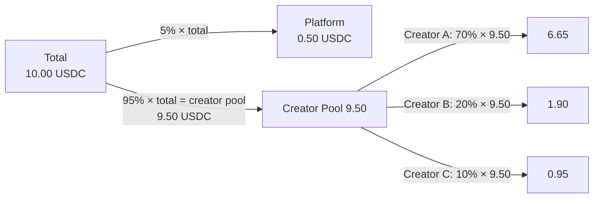
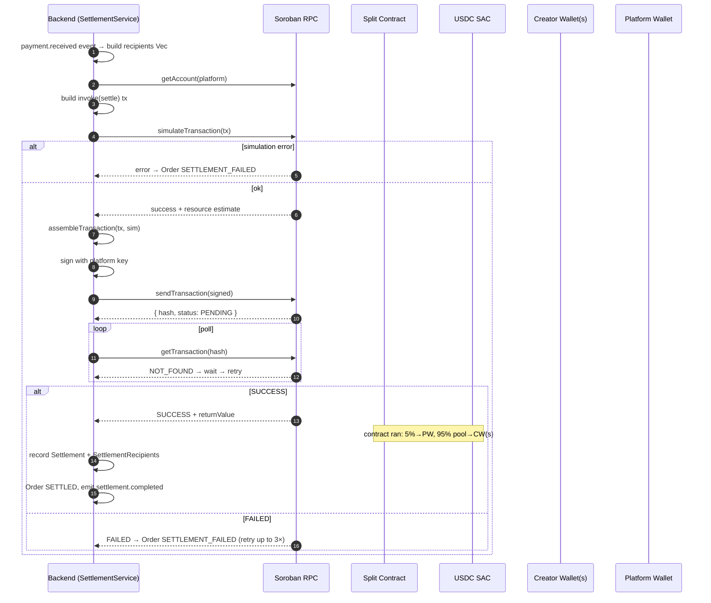
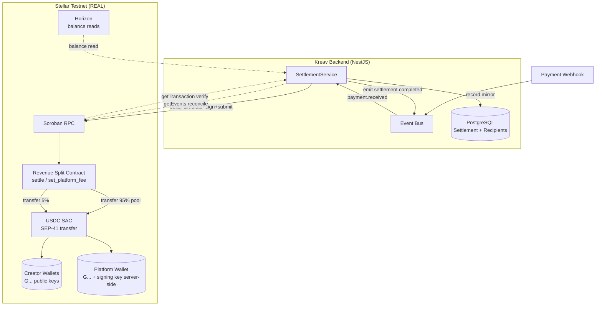

# Kreav Soroban Contract PRD

> **Status:** Complete architecture specification for every Soroban smart contract in Kreav. **Architecture, not implementation** (no Rust source here — that is the contract author's job; the backend agent's scope is *invoking* the contract).
> **Scope boundary:** This PRD specifies the contract's interface, behavior, security, storage, events, and the backend integration. The Stellar standards/SDKs are in the **Stellar Standards PRD**; the off-ramp/anchor is in the **Anchor PRD**; the data model/APIs are in the **Kreav Backend PRD**.
> **Authority:** Written against the [soroban skill](https://github.com/stellar/stellar-dev-skill/blob/main/skills/soroban/SKILL.md) (Parts 1, 3, 4, 5), [assets skill](https://github.com/stellar/stellar-dev-skill/blob/main/skills/assets/SKILL.md) (SAC), and [data skill](https://github.com/stellar/stellar-dev-skill/blob/main/skills/data/SKILL.md) (RPC). The soroban skill's **Part 3 security checklist** governs §9.

---

## 0. Resolved facts (from Backend PRD v3.1 §19, §20)

These are binding inputs to the contract design:

- **Split:** `95% Creator / 5% Platform`. The 5% platform fee is taken first; the 95% creator pool is then split by `revenue_percentage` among `ProductCollaborator` rows (which must sum to 100% of the creator pool).
- **The contract does the split, not the backend** (Backend PRD §19: "executed by the Soroban Smart Contract").
- **Demo invariant:** 10 USDC → 9.50 creator / 0.50 platform (single-creator demo; multi-collaborator is the general case).
- **Invoker:** the platform account signs/submits the settlement transaction (see Stellar Standards PRD ED-2) using `PLATFORM_WALLET_SECRET` (ED-10). Creators' wallets only **receive** — they do not co-sign settlements.
- **Asset:** USDC (classic, via SAC). **7 decimals** on-chain. Kreav DB stores `Decimal(18,2)`.
- **Funding source — pre-funded float (ADR C1; ED-9):** the `source` account (the platform account) holds a **pre-funded testnet USDC float** topped up out-of-band by the team (Implementation Backlog BC-011). The buyer's GCash payment is mocked (no USDC minted), so every `settle` draws this float down by the full purchase amount. Insufficient balance → `settle` reverts (§9). Production replaces the float with a real on-ramp crediting the account.
- **Idempotency ref (ADR H2):** the contract's `order_ref` parameter **= the backend `Order.id` (the UUID)**. A duplicate `settle` for the same `order_ref` is rejected by the contract (§9). This maps 1:1 to the backend's idempotency on `paymentRef` (Backend PRD §20).

---

## 1. Philosophy

### Why smart contracts exist (in Kreav)

The split is **programmable money**: the moment a payment is confirmed, an on-chain program enforces that 95% goes to the creator and 5% to the platform. This is *trust-minimized* — neither the buyer, the creator, nor the backend operator can alter the split. The split rule lives in code that anyone can read and verify.

This is the **wow moment** of the demo: a real testnet tx, a real explorer link, a real 9.50 USDC arriving in the creator's wallet.

### Why logic is NOT duplicated in the backend

| Concern | Owner | Why |
|---------|-------|-----|
| Split arithmetic (95/5, collaborator percentages) | **Contract** | It's money movement — must be on-chain & verifiable |
| Collaborator percentage validation (sums to 100%) | **Backend** (pre-flight) **and** Contract (authoritative) | Backend validates early for UX; contract validates authoritatively for safety (defense in depth) |
| Recording the settlement (1 Settlement + N SettlementRecipient rows) | **Backend** (PostgreSQL) | Application/accounting state — not chain state |
| Invoking + verifying the tx | **Backend** | Orchestration — read the result, persist txHash |

> **Rule:** any logic that moves USDC lives **only** in the contract. The backend *reads* results and *records* them, but never recomputes a split that the contract already performed. This prevents the backend from ever disagreeing with the chain about who got what.

---

## 2. Contract Inventory

| Contract | Purpose | MVP status |
|----------|---------|------------|
| **Revenue Split Contract** | Splits incoming USDC 95% creator pool / 5% platform, distributing the creator pool across collaborators | ✅ **MVP — the one contract Kreav ships** |
| Platform Fee (config) | A configurable platform-fee parameter (5%) within the split contract | ✅ MVP (part of the split contract, not separate) |
| Staking | Creator stake / reputation | 🔵 Future (see §15) |
| Reputation | On-chain creator reputation | 🔵 Future |
| Escrow | Held funds pending delivery | 🔵 Future |
| Dispute | On-chain dispute resolution | 🔵 Future |
| Subscription | Recurring payments | 🔵 Future |
| Royalty | Per-resale royalties | 🔵 Future |
| Streaming Payments | Continuous money-stream | 🔵 Future |

Only **one** contract ships in MVP. The rest are §15.

---

## 3. Revenue Split Contract (the MVP contract)

### Interface (specification, not Rust)

The contract exposes a single primary function plus an admin function:

```
// Primary: settle a purchase
fn settle(
    env: Env,
    usdc_sac: Address,          // USDC SAC contract address (C...)
    source: Address,            // platform account = the pre-funded USDC float holder (ADR C1); invoker
    order_ref: Symbol,          // idempotency key = Order.id (ADR H2); duplicate settle rejected
    total_amount: i128,         // total USDC in base units (7 decimals)
    recipients: Vec<Recipient>, // { address, role, share_bps } — creator pool + platform
) -> SettlementResult
//   where Recipient { address: Address, role: Symbol, share_bps: i128 }
//   and   SettlementResult { tx_ok: bool, distributed: Vec<{address, amount}> }

// Admin: set platform fee
fn set_platform_fee_bps(env: Env, fee_bps: u32)   // 500 = 5.00%
fn get_platform_fee_bps(env: Env) -> u32
```

### Input

| Parameter | Type | Validation (contract-side) |
|-----------|------|----------------------------|
| `usdc_sac` | Address | Must equal the stored/known USDC SAC address (allowlist — see §9) |
| `source` | Address | The platform account (the pre-funded float holder, ADR C1); must `require_auth()` (see §8) |
| `order_ref` | Symbol | Idempotency key. The backend passes `Order.id` (ADR H2). A duplicate `settle` for the same `order_ref` is rejected (§9) |
| `total_amount` | i128 | Must be > 0; sanity-checked against an upper bound to prevent overflow abuse |
| `recipients` | Vec | The creator-pool members + their basis-point shares; **must sum to 10000 bps (100%) of the creator pool**. Platform recipient is added by the contract itself at `fee_bps` |

> **Basis points (bps):** percentages are expressed in bps to avoid float. `95% = 9500 bps`, `5% = 500 bps`. The platform fee is stored as `500` bps.

### Validation (defense in depth)

The contract validates **authoritatively** (the backend also validates pre-flight for UX, but the contract is the source of truth):

1. `source.require_auth()` — only the platform account may invoke `settle` (§8).
2. `usdc_sac` is the allowlisted USDC SAC (§9 — arbitrary-contract-call prevention).
3. `total_amount > 0` and within sane bounds.
4. Creator-pool shares sum to exactly 10000 bps. **Mismatch → panic (revert).** This is the critical money-integrity check.
5. Each recipient address is non-zero.

### Output

`settle` returns a `SettlementResult` with the per-recipient distributed amounts (in base units). It also performs the actual USDC transfers via the SAC's SEP-41 `transfer`:

```rust
// Pseudocode (for spec clarity; not the implementation)
let token = TokenClient::new(&env, &usdc_sac);
let platform_cut = total_amount * fee_bps / 10000;
let creator_pool = total_amount - platform_cut;

// Platform
token.transfer(&source, &platform_wallet, &platform_cut);

// Creator pool, each collaborator by share_bps
for r in recipients {
    let amount = creator_pool * r.share_bps / 10000;
    token.transfer(&source, &r.address, &amount);
}
```

### Events

Emitted via `#[contractevent]` (soroban skill, Events section):

| Event | Topics | Payload | When |
|-------|--------|---------|------|
| `SettlementExecuted` | `["settle", order_ref]` | `{ source, total_amount, platform_cut, creator_pool }` | After successful split |
| `RecipientPaid` | `["settle", "recipient"]` | `{ address, role, amount }` | Per recipient transfer |
| `PlatformFeeChanged` | `["admin", "fee"]` | `{ old_bps, new_bps, admin }` | On `set_platform_fee_bps` |

> The backend indexes these via RPC `getEvents` (filter by contract id + topics) for reconciliation — see §10.

### Failure

| Failure | Contract behavior |
|---------|-------------------|
| Invalid `source` auth | `require_auth()` panics → tx reverts |
| Wrong `usdc_sac` | panic("unauthorized asset") → revert |
| Shares ≠ 10000 bps | panic("shares must total 100%") → revert |
| Recipient lacks USDC trustline | SAC `transfer` fails → `op_no_trust` → **whole tx reverts** (atomicity) |
| Overflow | checked arithmetic panics → revert |
| Insufficient source balance | SAC transfer fails → revert |

> **Atomicity guarantee:** Soroban transactions are atomic. If *any* recipient transfer fails, the entire settlement reverts — no partial payouts. This is a critical money-safety property.

### Storage

| Storage type | Key | Value | TTL |
|--------------|-----|-------|-----|
| Instance | `Admin` | Address (platform admin) | instance (survives with contract) |
| Instance | `PlatformFeeBps` | u32 (default 500) | instance |
| Instance | `UsdcSac` | Address (allowlisted) | instance |
| Persistent | `Settlement(order_ref)` | SettlementResult | extended on write (§7) |

All keys are a typed `DataKey` enum (soroban skill §9 vulnerability #5 — avoid key collisions).

### Authorization

See §8.

### Upgrade strategy

The contract is upgradeable via SEP-0049 patterns (soroban skill §4). The upgrade authority is the admin (platform). MVP deploys once; future upgrades (e.g., fee changes, new recipient types) ship as a versioned WASM + migration. **Upgrades are out of MVP scope** but the design leaves room (admin key, version metadata).

---

## 4. Collaborator Split

### How 95% becomes multiple collaborators

The 5% platform fee is taken **first** off the total. The remaining **95% (creator pool)** is divided among collaborators by their `revenue_percentage` (stored in `ProductCollaborator`).



> **Note on the demo:** the single-creator demo (one creator = 100% of the pool) yields 9.50 USDC to one wallet — the headline "9.50 creator / 0.50 platform." The multi-collaborator case is the same math with the pool split further.

### How the backend maps collaborators

1. On `payment.received`, the backend reads `ProductCollaborator` rows for the product (status `ACTIVE`).
2. It validates their `revenue_percentage` values sum to **100.00** (the creator pool). Mismatch → `SETTLEMENT_FAILED` (no contract invocation).
3. It builds the `recipients` Vec (address + role + share_bps) and invokes `settle`.
4. The **contract** re-validates the sum (authoritative).
5. On success, the backend records **one `Settlement`** row + **N `SettlementRecipient`** rows (one per recipient, including platform) — mirroring the contract's distribution exactly.

> **Backend ↔ contract agreement:** the backend's `SettlementRecipient` table is a **mirror** of what the contract did, derived from the contract's return value + events. It is never an independent computation.

---

## 5. Settlement Model



> **Atomicity recap:** steps inside the contract (all transfers) succeed or fail together. The backend only records success after `getTransaction == SUCCESS`.

---

## 6. Events

Every event the contract emits (see §3 Events table). The backend subscribes/reconciles via:

- **Primary:** RPC `getTransaction(hash).returnValue` — the authoritative result.
- **Secondary:** RPC `getEvents` filtered by contract id — for cross-checking each `RecipientPaid` against the recorded `SettlementRecipient`.

| Backend reaction | Trigger |
|------------------|---------|
| Record Settlement + recipients | `getTransaction == SUCCESS` |
| Emit `settlement.completed` (internal event bus) | After DB write |
| Mark Order `SETTLED` | On successful record |
| Mark Order `SETTLEMENT_FAILED` | `getTransaction == FAILED` after retries |

---

## 7. Contract Storage

Per the soroban skill (Storage Types, Part 1 + Pitfall #4):

| Type | Used for | Why this type |
|------|----------|---------------|
| **Instance** | `Admin`, `PlatformFeeBps`, `UsdcSac` | Shared config/admin — survives with the contract instance |
| **Persistent** | `Settlement(order_ref)` | Settlement records — can be archived/restored; extended on write |
| Temporary | (not used in MVP) | — |

### TTL management

- **Instance storage:** auto-extended with the contract; extend proactively in `settle` (soroban skill Pitfall #3) — `env.storage().instance().extend_ttl(threshold, extend_to)`.
- **Persistent `Settlement` keys:** extended on write. MVP doesn't require long-lived settlement history on-chain (the backend is the system of record for history); a modest TTL (~30 days = 518400 ledgers) is fine.

> ⚠️ **Archival awareness (soroban skill Part 3 #7).** If on-chain settlement data is archived (TTL expires), it can be *restored* (via a tx) but not silently lost. The backend's PostgreSQL is the durable record; on-chain storage is for verifiability, not the sole history.

---

## 8. Authorization

### Who can invoke

| Function | Authorized caller | Mechanism |
|----------|-------------------|-----------|
| `settle` | **Platform account only** | `source.require_auth()` where `source` is the platform `G...`; the platform key signs the tx |
| `set_platform_fee_bps` | **Admin** (platform admin key) | `admin.require_auth()` |
| `get_platform_fee_bps` (read) | Anyone | No auth (read-only) |

### Who CANNOT invoke

- ❌ A creator cannot call `settle` (they are recipients, not the invoker).
- ❌ A buyer cannot call anything (they have no role in the contract).
- ❌ An arbitrary address cannot change the fee (not admin).

### Why the platform is the sole invoker

The backend must drive settlement the instant a payment webhook confirms — it cannot wait for each creator to co-sign. The platform account is therefore the **single signer** for settlement. This concentrates signing authority in one key, which is the deliberate tradeoff (Stellar Standards PRD ED-2): that key must be **heavily guarded, server-side, never exposed, rotatable.**

> This does **not** violate non-custodial design: the platform key moves the *buyer's* USDC (the purchase funds) per the split — it never moves *creator* funds. Creators' wallets only receive.

---

## 9. Security

Governed by the [soroban skill Part 3 checklist](https://github.com/stellar/stellar-dev-skill/blob/main/skills/soroban/SKILL.md). Each checklist item applied:

### Soroban-specific checklist (Part 3)

| Checklist item | Kreav contract compliance |
|----------------|---------------------------|
| All privileged functions require authorization | ✅ `settle` → `source.require_auth()`; `set_platform_fee_bps` → `admin.require_auth()` |
| Initialization can only happen once | ✅ `__constructor` (Protocol 22+) or a guarded `initialize` with an `Initialized` flag (reinit-attack prevention, Part 3 #2) |
| External contract calls are validated against allowlists | ✅ `usdc_sac` must match the stored USDC SAC address (Part 3 #3 — arbitrary-contract-call prevention) |
| All arithmetic uses checked operations | ✅ `checked_mul`/`checked_add` for bps math (Part 3 #4 — overflow prevention) |
| Storage keys are typed and collision-free | ✅ typed `DataKey` enum (Part 3 #5) |
| Critical data TTLs are extended proactively | ✅ instance + settlement keys extended (Part 3 #7) |
| Input validation on all public functions | ✅ amounts > 0, shares sum 10000, addresses non-zero |
| Events emitted for auditable state changes | ✅ `SettlementExecuted`, `RecipientPaid`, `PlatformFeeChanged` |

### Vulnerability categories (Part 3) — explicit mitigation

| Vulnerability | Mitigation |
|---------------|------------|
| 1. Missing authorization | `require_auth` on every privileged fn |
| 2. Reinitialization | Single-init guard (`Initialized` flag) |
| 3. Arbitrary contract calls | USDC SAC allowlist |
| 4. Integer overflow | Checked arithmetic; bps math bounded |
| 5. Storage key collision | Typed `DataKey` enum |
| 6. Timing/state race | Atomic tx; all checks+transfers in one invocation |
| 7. TTL/archival | Proactive `extend_ttl` |
| 8. Cross-contract return validation | Sanity-check SAC `transfer` success; trust only known SAC |

### Classic Stellar security (Part 3)

| Concern | Mitigation |
|---------|------------|
| Trustline attacks | Only Circle USDC issuer; no user-defined assets |
| Clawback awareness | USDC testnet — confirm `auth_clawback_enabled` flag; for production, document clawback posture to creators |
| Account merge | n/a (no merge operations in Kreav flows) |

### Replay protection

- Each `settle` invocation is bound to a unique `order_ref` (the order/payment id). The contract records `Settlement(order_ref)`; a **duplicate** `settle` with the same `order_ref` is rejected (idempotency at the contract layer, mirroring the backend's `payment_ref` idempotency).
- The `order_ref` is also embedded in the event topic for traceability.

### Reentrancy

Per the soroban skill (Part 3 advantages): Soroban has **no classical reentrancy** (synchronous execution). Self-reentrancy is possible but not exploitable here (no callbacks into untrusted contracts; the only external call is to the allowlisted USDC SAC).

### Upgrade security

- Upgrade authority = admin only (`require_auth`).
- SEP-0049 upgrade process; version metadata in WASM (SEP-0046).
- **MVP:** no live upgrade performed (deploy once). Future upgrades require a documented migration + rollback plan (Part 4).

---

## 10. Backend Integration

Exactly how the backend (NestJS, `@stellar/stellar-sdk`) interacts:

### RPC (the path)

```typescript
const rpc = new StellarSdk.rpc.Server(process.env.SOROBAN_RPC_URL);
const contract = new StellarSdk.Contract(process.env.SPLIT_CONTRACT_ID);
```

### Simulation (mandatory before submit)

```typescript
const sim = await rpc.simulateTransaction(tx);
if (StellarSdk.rpc.Api.isSimulationError(sim)) {
  // → Order SETTLEMENT_FAILED (simulation failure path)
  throw sim.error;
}
tx = StellarSdk.rpc.assembleTransaction(tx, sim).build();
```

### Submission

```typescript
tx.sign(platformKeypair);                 // server-side platform key
const resp = await rpc.sendTransaction(tx);
if (resp.status === 'ERROR') { /* → SETTLEMENT_FAILED */ }
```

### Verification (the demo's truth source)

```typescript
let result = await rpc.getTransaction(resp.hash);
while (result.status === 'NOT_FOUND') {
  await sleep(1000);
  result = await rpc.getTransaction(resp.hash);
}
if (result.status === 'SUCCESS') {
  const distributed = parseReturnValue(result.returnValue); // per-recipient amounts
  // → record Settlement + SettlementRecipients (mirror of `distributed`)
  // → Order SETTLED
} else {
  // → SETTLEMENT_FAILED
}
```

### Retry

- **Simulation failure:** no retry (logic error) → `SETTLEMENT_FAILED`.
- **Network/timeout:** retry the *verify* poll (not a new settle — that risks double-settlement). Backend PRD §20: max 3 retries, then manual review.
- **Idempotency:** a retried settle for the same `order_ref` is rejected by the contract (§9). The backend never re-invokes a settle that already returned `SUCCESS`.

### Monitoring

- **Success signal:** `getTransaction(hash).status === 'SUCCESS'`.
- **Cross-check:** `getEvents` → every `RecipientPaid` matches a recorded `SettlementRecipient`.
- **Alert:** any settle that doesn't reach `SUCCESS` within the retry budget → paged for manual review (Order stays `SETTLEMENT_FAILED`).

---

## 11. Failure Handling

| Failure mode | Detection | Kreav response | Retry? |
|--------------|-----------|----------------|--------|
| **Simulation failure** | `isSimulationError(sim)` | Order `SETTLEMENT_FAILED`; record error | ❌ no (logic error) |
| **Submission error** | `sendTransaction` → `ERROR` | Order `SETTLEMENT_FAILED` | ❌ no (bad tx) |
| **Execution failure** (trustline missing, overflow) | `getTransaction === FAILED` | Order `SETTLEMENT_FAILED`; if trustline → flag `WAITING_WALLET` | up to 3× then manual |
| **Network failure** (RPC down) | timeout / connection error | Order stays `SETTLEMENT_PENDING`; retry verify poll | ✅ exponential backoff |
| **Horizon timeout** (balance read) | Horizon down | retry with backoff; label cached balance stale | ✅ |
| **Duplicate settle** | contract rejects duplicate `order_ref` | no-op; log | ❌ |

> **Money-safety invariant:** no retry ever causes a double-settlement. Retries are on *verification*, not on *invocation*. The contract's `order_ref` idempotency is the last line of defense.

---

## 12. Monitoring

How the backend knows settlement succeeded:

1. **Primary:** `rpc.getTransaction(hash).status === 'SUCCESS'` within the poll window.
2. **Secondary:** `rpc.getEvents` for `SettlementExecuted` + `RecipientPaid` on the contract id.
3. **Reconciliation:** backend compares recorded `SettlementRecipient` rows against the contract's emitted/distributed amounts. Mismatch → alert (should never happen; indicates a bug).
4. **Explorer link:** the txHash is surfaced to the frontend for the human-verifiable "wow."

---

## 13. Sequence Diagram

```mermaid
sequenceDiagram
    autonumber
    participant WH as Webhook (payment)
    participant BE as Backend
    participant EB as Event Bus
    participant SS as SettlementService
    participant RPC as Soroban RPC
    participant SC as Split Contract
    participant SAC as USDC SAC
    participant CW as Creator Wallet(s)
    participant PW as Platform Wallet
    participant DB as PostgreSQL

    WH->>BE: payment confirmed
    BE->>EB: emit payment.received
    EB->>SS: handle
    SS->>SS: read ProductCollaborator rows; validate sum=100%
    SS->>DB: Order → SETTLEMENT_PENDING
    SS->>RPC: getAccount(platform) → build settle tx
    SS->>RPC: simulateTransaction
    RPC-->>SS: resource estimate
    SS->>SS: assembleTransaction + sign(platform key)
    SS->>RPC: sendTransaction
    RPC-->>SS: { hash }
    loop verify poll
        SS->>RPC: getTransaction(hash)
    end
    RPC-->>SS: SUCCESS + returnValue
    Note over SC,SAC: contract executed: 5%→PW, pool→CW(s) atomically
    SS->>DB: write Settlement + N SettlementRecipients (mirror)
    SS->>EB: emit settlement.completed
    EB->>BE: Order → SETTLED
```

---

## 14. Architecture Diagram



---

## 15. Future Contracts (Future Scope only — not MVP)

Each is documented as a candidate, not a commitment. All gated behind the MVP shipping first.

| Future contract | Purpose | Why future | SEP/skill basis |
|-----------------|---------|------------|-----------------|
| **Staking** | Creators stake USDC to earn reputation/boost | Requires a staking economics design + reward source | soroban skill Part 4 (DeFi primitives); Backend PRD §20 "Future Reputation Domain" (Stake, StakeReward, SlashEvent) |
| **Reputation** | On-chain creator reputation score | Needs an attestation/weighting model | SEP-0048 contract interface |
| **Escrow** | Held funds pending digital delivery | Requires a dispute/timeout policy | soroban skill Part 4 (timelock/escrow patterns) |
| **Dispute** | On-chain dispute resolution | Needs an arbitrator set + slashing | soroban skill Part 4 (governance) |
| **Subscription** | Recurring payments | Needs renewal/expiration state + auth delegation | soroban skill Part 4; SEP-0041 |
| **Royalty** | Per-resale creator royalties | Needs asset lineage tracking | SEP-0050 (NFT, draft) |
| **Streaming Payments** | Continuous money streams | Needs a sweep/ledger-tick model | soroban skill Part 4 (DeFi primitives) |

> **None of these are built in MVP.** The MVP ships exactly one contract: the Revenue Split Contract (§3).

---

*Cross-reference: Stellar standards/SDKs → **Stellar Standards PRD**; off-ramp/anchor → **Anchor PRD**; data model/APIs/state machine → **Kreav Backend PRD**.*

---

> **Architecture Consistency Check:** see [`docs/reviews/Architecture-Consistency-Check.md`](../reviews/Architecture-Consistency-Check.md) — verifies no contradictions with the Backend PRD or between the three new PRDs, and lists the Backend PRD edits required after these documents.
