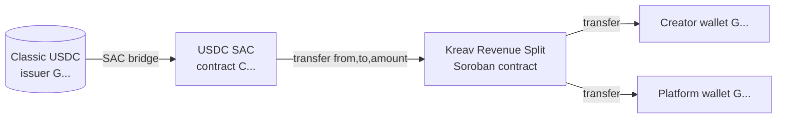
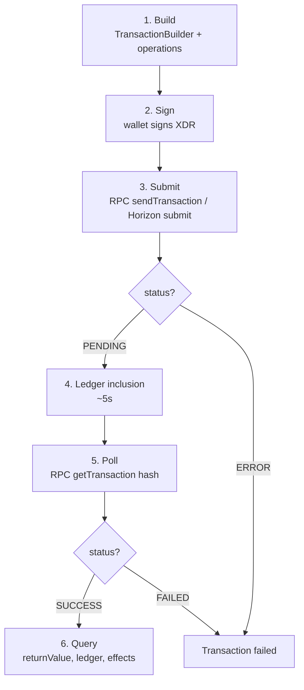

# Kreav Stellar Standards PRD

> **Status:** Source of truth for every Stellar standard, protocol, SDK, and architectural decision used by Kreav.
> **Supersedes:** Where this document conflicts with informal Stellar references in `docs/backend/Backend-PRD.md`, this PRD governs the *Stellar-specific* mechanics (account model, asset, RPC vs Horizon, SEPs, SDK choice). The Backend PRD remains the source of truth for the NestJS application layer and data model.
> **Authority:** Written against the official [Stellar Skills](https://skills.stellar.org) corpus ([stellar/stellar-dev-skill](https://github.com/stellar/stellar-dev-skill)). Where official Stellar documentation conflicts with prior Kreav assumptions, official documentation wins and the change is documented explicitly (see §11 and the Architecture Consistency Check).

---

## 0. Resolved contradiction (read first)

Two earlier Kreav documents disagree on wallet strategy:

| Document | Says |
|----------|------|
| `docs/product/Product-Scope.md` | "Sponsored **Custodial** Wallet" — Kreav creates the wallet, funds reserve, creates trustline, holds keys |
| `docs/backend/Backend-PRD.md` v3 §4 + §11 + AGENTS.md (DECIDED) | **Non-Custodial** — creator connects their own Freighter/Lobstr wallet; backend stores **only the public key** |

**Resolution: NON-CUSTODIAL WINS.** This is the decided state (AGENTS.md "Source of truth & wallet strategy (DECIDED)"), it is consistent with the v3.1 addendum (which does not override wallet strategy), and — critically — it aligns with the Stellar security model in the official skills: a backend that holds creator private keys/seed phrases is a high-value theft target and contradicts the non-custodial ethos of the Stellar wallet ecosystem. Kreav's backend never holds funds, never stores secret keys, never does custody.

> **Action for Backend PRD:** the Product Scope's "Sponsored Custodial Wallet" wording should be revised to "Non-Custodial (creator-supplied wallet)" — see Architecture Consistency Check §C.

---

## 1. Stellar Overview

### Why Stellar

Kreav is a **programmable settlement layer for digital-product creators**. The core value is: a buyer pays, a Soroban contract splits the revenue (95% creator / 5% platform), the creator receives USDC in their own wallet, and the whole thing is verifiable on-chain in seconds.

Stellar fits this because:

| Property | Why it matters to Kreav |
|----------|-------------------------|
| **Fast, deterministic finality** (~5s ledgers) | Settlement + on-chain verification happens within the ~3-minute demo window — no long waits on stage |
| **Native stablecoin rails (USDC)** | Creators get paid in a stable unit, not a volatile token — the demo's "9.50 USDC" must stay 9.50 USDC |
| **Soroban smart contracts** | The 95/5 split is *programmable money* — the contract enforces the split, the backend can't silently mis-divert funds |
| **Classic assets + SAC bridge** | USDC is a battle-tested classic asset (full ecosystem/wallet support), reachable from Soroban via the Stellar Asset Contract — no need to mint a custom token |
| **Low, predictable fees** | Micro-cent fees mean a 10 USDC settlement isn't eaten by gas |
| **Transparent settlement** | Every tx has a public hash + explorer link — the demo's "verify on-chain" moment is native to Stellar |

### Why not other chains

| Chain | Why not (for Kreav) |
|-------|---------------------|
| Ethereum / EVM L2s | Gas volatility + slower finality undermine a live settlement demo; USDC is bridged/wrapped rather than a native classic asset |
| Solana | Fast, but its account/token model and wallet ecosystem are less aligned with the "non-custodial creator connects their own wallet + receives USDC" UX Kreav wants |
| Cosmos / app-chain | Overkill — Kreav does not need its own consensus, only programmable settlement on an established network |

### Why Stellar fits creator payments specifically

The combination of **(a)** a real, liquid stablecoin (USDC) **(b)** movable by smart contract (Soroban) **(c)** into a creator's own non-custodial wallet **(d)** with sub-second-fees and **(e)** a public explorer link — is exactly the "buyer pays → creator gets paid verifiably" primitive that creator-payment infrastructure needs. Kreav does **not** use Stellar as a marketplace, social graph, or discovery layer (those are explicit non-goals).

---

## 2. Accounts

> Source: [Stellar Skills — data](https://github.com/stellar/stellar-dev-skill/blob/main/skills/data/SKILL.md), [assets](https://github.com/stellar/stellar-dev-skill/blob/main/skills/assets/SKILL.md); [Stellar docs — accounts](https://developers.stellar.org/docs/learn/fundamentals/stellar-data-structures/accounts).

### Account model

A Stellar account is identified by a **public key** (`G...`, a strkey-encoded ed25519 public key) and controlled by a matching **secret key** (`S...`, the ed25519 seed). Accounts hold balances (XLM + credit assets), submit transactions, and are the unit of authentication.

- **Public key (`G...`)** — shareable; identifies the account on-chain. **This is the only thing Kreav's backend stores** for a creator wallet (see §8).
- **Secret key (`S...`)** — the spending authority. **Kreav's backend NEVER holds, sees, or transits this.** Signing is the creator's responsibility, done in their own wallet (Freighter/Lobstr).

### Account activation & minimum balance

An account does not exist on-chain until it is **funded** (created) with at least the base reserve of XLM. On Stellar:

- **Base reserve** is 0.5 XLM (per the network's `base_reserve`).
- Every **trustline**, **offer**, and **signer** added to an account costs an additional 0.5 XLM (held as a reserve, not a fee).
- An **unfunded** `G...` address is valid as a destination string but cannot hold assets or sign until funded.

### How this applies to Kreav

| Concern | Kreav behavior |
|---------|----------------|
| Creator account creation | **NOT Kreav's job (non-custodial).** The creator brings an already-funded Freighter/Lobstr account. The backend stores only the `G...` public key. |
| Reserve for trustline | A creator who wants to receive USDC must hold enough XLM reserve for the USDC trustline (+ base reserve). This is a real prerequisite flagged in the settlement flow — see §5 and the Soroban Contract PRD §11. |
| Platform account | The platform's own `G...` account (`PLATFORM_WALLET_ADDRESS`) must exist and be funded, with a USDC trustline, to receive the 5% fee. This is provisioned by the team, not generated by the backend. |
| Unfunded creator address | If a creator connects a `G...` that is unfunded or lacks the USDC trustline, **settlement must defer** — this maps to the `WAITING_WALLET` order state (v3.1 §20), not a silent failure. |

---

## 3. Assets

> Source: [Stellar Skills — assets](https://github.com/stellar/stellar-dev-skill/blob/main/skills/assets/SKILL.md).

Stellar has two token mechanisms:

| Mechanism | Description |
|-----------|-------------|
| **Native XLM** | Stellar's native currency; no trustline needed; used to pay fees and reserves |
| **Classic (credit) assets** | Issued by an account (`Asset(code, issuer)`); require a **trustline** to hold; USDC is one of these |
| **Soroban custom tokens** | Custom contracts with flexible logic — only when classic isn't enough |

The **Stellar Asset Contract (SAC)** bridges a classic asset into Soroban: `asset.contractId(Networks.TESTNET)` yields a deterministic `C...` contract address that exposes the standard SEP-41 token interface (`transfer`, `balance`, etc.). The skill's explicit guidance: **prefer classic assets over custom Soroban tokens unless custom logic is required.**

### Which one Kreav uses

**USDC — a classic credit asset, reached from Soroban via the SAC.**

- **Asset code:** `USDC`
- **Testnet issuer (`G...`):** `GBBD47IF6LWK7P7MDEVSCWR7DPUWV3NY3DTQEVFL4NAT4AQH3ZLLFLA5` (Circle testnet USDC — from the `agentic-payments` skill's canonical constants)
- **Testnet SAC contract (`C...`):** `CBIELTK6YBZJU5UP2WWQEUCYKLPU6AUNZ2BQ4WWFEIE3USCIHMXQDAMA`
- **Decimals:** **7** (USDC on Stellar uses 7 decimals — NOT 6 like EVM USDC). `$0.001 = 10000` base units. Kreav stores money as `Decimal(18,2)`; the backend must scale correctly between DB units and on-chain base units (see Soroban Contract PRD §3).



> ⚠️ **Two USDC addresses — do not confuse.** The classic issuer `G...` is used when creating trustlines; the SAC contract `C...` is what the split contract calls. The `USDC_ISSUER` env var holds the `G...`; the SAC address is derived from it, not stored separately.

**XLM** is used only for fees + reserves — Kreav never pays creators in XLM.

**Kreav does NOT mint a custom token.** No `KREAV` token; no custom Soroban token contract. This is deliberate (see §13).

---

## 4. Transactions

A Stellar transaction is the atomic unit of state change. The lifecycle the Kreav backend cares about:



### Kreav-specific transaction types

| Tx type | Who builds | Who signs | Who submits | Status source |
|---------|-----------|-----------|-------------|---------------|
| **Settlement split (Soroban)** | Backend (the platform account is source) | Platform account key (the platform is the invoker; this is the backend's authority, see Soroban Contract PRD §8) | Backend → RPC | `rpc.getTransaction(hash)` |
| **Withdrawal (off-ramp)** | Mocked anchor / future real anchor | Anchor or creator | Anchor | Mocked in MVP (see Anchor PRD) |
| **Creator balance read** | n/a (read-only) | n/a | Backend → Horizon | Horizon `loadAccount` |

> **Key decision:** the platform account is the **invoker/source** of the settlement transaction. This is necessary because the backend must drive the split the moment payment is confirmed — it cannot wait for the creator to manually co-sign each settlement. The platform account's key is the one piece of signing authority the backend holds (server-side, never exposed). The creators' wallets only **receive** — they do not sign settlements. This is consistent with non-custodial design (see §8).

> **MVP funding model — pre-funded USDC float (ADR C1).** Because the buyer pays via **mock GCash** (no real fiat→USDC conversion in the demo), the Soroban `settle` contract draws from a **pre-funded float** held by the platform account: the team tops up `PLATFORM_WALLET_ADDRESS` with testnet USDC out-of-band before the demo (see Implementation Backlog **BC-011**). Each settlement draws the float down by the full purchase amount (−10 USDC: 9.50 to the creator, 0.50 credited to the platform's own balance). The float must be topped up before it depletes; otherwise the SAC `transfer` reverts on insufficient balance → `SETTLEMENT_FAILED` (Soroban Contract PRD §9). **Production replaces the manual float with a real on-ramp that credits the account automatically** (Anchor PRD §15). The platform account also needs a USDC trustline (§5).

---

## 5. Trustlines

> Source: [Stellar Skills — assets / trustlines](https://github.com/stellar/stellar-dev-skill/blob/main/skills/assets/SKILL.md).

### Why required

A trustline is an explicit "I am willing to hold this asset from this issuer" relationship between an account and a credit asset. **Without a USDC trustline, an account cannot receive USDC** — a SAC `transfer` into a trustline-less account fails with `op_no_trust`.

### When created

Trustlines are created by a `changeTrust` operation signed by the account owner. This is **always the wallet owner's action** — Kreav's backend cannot create a trustline on a creator's account (non-custodial: no secret key).

### Wallet responsibility & UX

| Actor | Trustline responsibility |
|-------|---------------------------|
| **Creator** | Must create the USDC trustline in their own Freighter/Lobstr wallet **before** they can receive settlements. This is a creator onboarding step. |
| **Platform account** | Team provisions the USDC trustline once. |
| **Backend** | Before settling, **verifies** the creator's trustline exists (via Horizon `loadAccount` → balances, or RPC `getAccount`). If missing → `WAITING_WALLET` (v3.1 §20), not a silent failure. |

**UX implication for the demo:** the Indonesian creator in the demo comes with a pre-configured wallet (funded + trustline ready) so there is no on-stage wallet setup. This is documented in `docs/product/Demo-PRD.md` ("Demo Failure Conditions: no wallet setup on stage").

> ⚠️ **Trustline attacks (security awareness).** The `soroban` skill (Part 3, Classic Stellar Security) warns that users can create trustlines to malicious assets that look legitimate. Kreav mitigates this by using the well-known Circle USDC issuer only (no user-defined assets) and never letting the backend auto-create trustlines to arbitrary issuers.

---

## 6. Horizon

> Source: [Stellar Skills — data / Horizon](https://github.com/stellar/stellar-dev-skill/blob/main/skills/data/SKILL.md).

### What it is

Horizon is Stellar's **REST API** (legacy). It provides rich historical data: account balances, transactions, operations, effects, payments, streaming (SSE), and pagination over the full chain history.

### When the backend uses it

| Use case | Why Horizon |
|----------|-------------|
| **Read a creator's USDC balance** (`GET /wallet/balance`) | Horizon `loadAccount` returns a full balance object including the USDC credit balance + trustline authorization status — exactly what the wallet screen needs |
| **Confirm trustline presence** (pre-settlement) | Same `loadAccount` balances lookup |
| **Explorer-facing transaction detail** (BE-010) | Horizon's operations/effects are richer for a human-readable explorer link than RPC's terse result |

### What NOT to use Horizon for

| Anti-use-case | Why not |
|---------------|---------|
| **Submitting Soroban (split) transactions** | RPC is the path for Soroban (`sendTransaction` → poll `getTransaction`). Horizon submission is legacy/classic-focused. |
| **Reading contract events** | RPC `getEvents` is the contract-event API; Horizon does not surface Soroban contract events. |
| **Primary settlement verification** | For the split tx itself, use RPC `getTransaction` (gives `returnValue`). Horizon is secondary/display-only. |

**Testnet endpoint:** `https://horizon-testnet.stellar.org` (env var `HORIZON_URL`).

---

## 7. Soroban RPC

> Source: [Stellar Skills — data / RPC](https://github.com/stellar/stellar-dev-skill/blob/main/skills/data/SKILL.md), [dapp](https://github.com/stellar/stellar-dev-skill/blob/main/skills/dapp/SKILL.md).

### Difference vs Horizon

The skill is explicit: **Stellar RPC is the preferred entry point for new projects; Horizon is legacy/historical.** RPC speaks JSON-RPC and is contract-centric (Soroban-first).

| | RPC | Horizon |
|---|-----|---------|
| Soroban contract calls | ✅ primary | ❌ |
| Transaction submission (Soroban) | ✅ `sendTransaction` | legacy/classic |
| Contract events | ✅ `getEvents` | ❌ |
| Account balances | ✅ `getAccount` (terse) | ✅ `loadAccount` (rich) |
| Full historical data | ❌ ~7-day window (except `getLedgers` infinite scroll) | ✅ full history |
| Streaming | ❌ poll only | ✅ SSE |

### Invocation (what the backend does for settlement)

The official pattern (dapp skill, backend-reusable):

```typescript
// 1. Load the invoker account (platform account)
const account = await rpc.getAccount(platformPublicKey);

// 2. Build the invoke tx
const contract = new StellarSdk.Contract(splitContractId);
let tx = new StellarSdk.TransactionBuilder(account, {
  fee: StellarSdk.BASE_FEE,
  networkPassphrase: StellarSdk.Networks.TESTNET,
})
  .addOperation(contract.call('settle', ...args))   // the split fn
  .setTimeout(180)
  .build();

// 3. Simulate to get resource estimates
const sim = await rpc.simulateTransaction(tx);
if (StellarSdk.rpc.Api.isSimulationError(sim)) {
  throw new Error(`Simulation failed: ${sim.error}`);
}

// 4. Assemble with the simulation's resource footprint
tx = StellarSdk.rpc.assembleTransaction(tx, sim).build();

// 5. Sign with the platform key + submit
tx.sign(platformKeypair);
const resp = await rpc.sendTransaction(tx);

// 6. Poll for result
let result = await rpc.getTransaction(resp.hash);
while (result.status === 'NOT_FOUND') {
  await new Promise((r) => setTimeout(r, 1000));
  result = await rpc.getTransaction(resp.hash);
}
// result.status === 'SUCCESS' → result.returnValue is the contract result
```

**Testnet endpoint:** `https://soroban-testnet.stellar.org` (env var `SOROBAN_RPC_URL`).

> ⚠️ **RPC 7-day window.** `getTransaction`/`getEvents` cover only ~7 days. Settlement verification runs seconds after the tx, so this is fine for the demo. Deep historical analysis would need Horizon/Hubble — not an MVP concern.

---

## 8. Wallet Standard

> Source: [Stellar Skills — dapp / wallets](https://github.com/stellar/stellar-dev-skill/blob/main/skills/dapp/SKILL.md), [standards](https://github.com/stellar/stellar-dev-skill/blob/main/skills/standards/SKILL.md).

### The options

| Wallet / standard | What it is | Kreav status |
|-------------------|------------|--------------|
| **Freighter** | SDF's flagship non-custodial browser wallet; Soroban support; `@stellar/freighter-api` | ✅ **MVP — primary** (matches Backend PRD §8, §11) |
| **LOBSTR** | Popular mobile wallet | ✅ **MVP — secondary** (Backend PRD §8 lists it) |
| **Stellar Wallets Kit** (`@creit.tech/stellar-wallets-kit`) | Multi-wallet aggregator (Freighter, LOBSTR, xBull, Albedo, Rabet, Hana, Ledger, Trezor, WalletConnect) | 🟡 **Post-MVP** — adopt when we want wallet-choice breadth without per-wallet integration |
| **Wallet Standard / WalletConnect** | Cross-wallet connection standards | 🟡 **Future** — comes for free via Wallets Kit |
| **Albedo** | Lightweight web signing provider | ❌ Not used |
| **Smart Account Kit (passkeys)** | Passwordless smart wallets (passkey-based) | 🔵 **Future** — interesting for "creator never sees a seed phrase" UX, but out of MVP scope |

### Which one Kreav uses (MVP)

**Freighter (primary) + LOBSTR (secondary)**, both **read-only from the backend's perspective.** The creator connects their wallet in the frontend (Freighter/Lobstr), the frontend sends the **public key** to the backend, the backend stores only that. The backend never requests signing, never holds the secret.

This is the non-custodial contract: the backend is a **settlement orchestrator**, not a wallet custodian. See §0 for the resolved contradiction.

### What the backend does NOT do with wallets

- Does not create wallets
- Does not fund account reserves
- Does not create trustlines
- Does not store secret keys / seed phrases
- Does not sign transactions on behalf of creators
- Does not custody creator funds

(The Product Scope's old "Sponsored Custodial Wallet" language described a model we explicitly rejected — see §0.)

---

## 9. Stellar SDK

### Which SDKs the backend uses

| SDK | Package | Purpose | Kreav use |
|-----|---------|---------|-----------|
| **JavaScript SDK** | `@stellar/stellar-sdk` | RPC client, Horizon client, TransactionBuilder, xdr, scVal helpers, `rpc.assembleTransaction` | ✅ **MVP — the one backend SDK.** All Stellar interaction (RPC invoke, Horizon balance read, tx build/simulate/submit) goes through this. |
| Rust SDK (soroban-sdk) | `soroban-sdk` | Writing Soroban contracts | Out of backend agent scope (contract authoring — see AGENTS.md), but the *contract itself* uses it. |
| Python / Java / Go SDK | community | — | Not used |

**Why the JS SDK:** it is the official SDK ([js-stellar-sdk](https://github.com/stellar/js-stellar-sdk)), Node 20+ supported, and provides the single `@stellar/stellar-sdk` import covering both `rpc.Server` (Soroban) and `Horizon.Server` (classic) — exactly the two surfaces Kreav's NestJS backend needs. It matches the patterns in the `dapp` and `data` skills verbatim.

> **Node version note:** the Stellar JS SDK dropped Node 18 support; requires **Node 20+**. Kreav runs on Node 24 ✅.

---

## 10. Every SEP relevant to Kreav

> Source: [Stellar Skills — standards](https://github.com/stellar/stellar-dev-skill/blob/main/skills/standards/SKILL.md).

| SEP | Purpose | Kreav status | Reason |
|-----|---------|--------------|--------|
| **SEP-0001** (stellar.toml) | Publish asset/domain metadata at `/.well-known/stellar.toml` | 🟡 **Post-MVP** | Once Kreav's domain is live, a `stellar.toml` documenting the platform account + USDC usage aids transparency. Not needed for the demo. |
| **SEP-0006** (programmatic deposit/withdrawal API) | Anchor API for automated on/off-ramp | 🔵 **Future** | Real off-ramp (creator → bank) would use SEP-6 for API-first flows. **MVP uses a mocked anchor** (see Anchor PRD). |
| **SEP-0010** (web authentication) | Challenge-response wallet auth → JWT | 🟡 **Post-MVP** | Backend PRD §6 lists "Wallet Authentication / SEP-10" as future scope. MVP does not require wallet-based backend auth (buyers are anonymous; creators connect via the frontend's wallet flow which sends the public key). Adopt SEP-10 when creator accounts need authenticated sessions. |
| **SEP-0012** (KYC data exchange) | Customer KYC between wallet & anchor | 🔵 **Future** | Required for real anchor off-ramp (banks demand KYC). **MVP: no KYC** (out of scope — see Product Scope). Production off-ramp will need SEP-12. |
| **SEP-0024** (hosted interactive anchor flow) | Hosted UI for deposit/withdrawal | 🟡 **MVP — mocked** | The Architecture diagram's anchor node is labeled "Mock SEP-24 Anchor." Kreav's MVP *simulates* a SEP-24 hosted withdrawal flow; a real SEP-24 anchor is post-MVP. See Anchor PRD. |
| **SEP-0031** (cross-border payments) | Sending rails between anchors | 🔵 **Future** | Not needed for MVP (single-corridor demo). Relevant if Kreav expands to multi-country real payout rails. |
| **SEP-0038** (quotes) | Price quotes for anchor transactions | 🔵 **Future** | Relevant to real off-ramp FX. Not in MVP (mocked anchor returns a fixed rate). See Anchor PRD §9. |
| **SEP-0041** (Soroban token interface) | Standard token interface (balance/transfer/…) | ✅ **MVP — foundational** | The USDC SAC implements SEP-41; the split contract calls USDC through this interface. Kreav depends on SEP-41 implicitly via the SAC. |
| SEP-0007 (uri/deeplinks) | Payment URIs | 🔵 Future | Optional UX nicety; not MVP. |
| SEP-0023 (strkey) | Address encoding | ✅ MVP (implicit) | All `G...`/`S...`/`C...` addresses use strkey. Not something Kreav "implements" — it's the wire format. |

### Summary by status
- **MVP / foundational:** SEP-41 (via SAC), SEP-23 (implicit), SEP-24 (**mocked**)
- **Post-MVP:** SEP-1, SEP-10
- **Future:** SEP-6, SEP-12, SEP-31, SEP-38

---

## 11. Engineering Decisions

| # | Decision | Reason | Tradeoff | Impact |
|---|----------|--------|----------|--------|
| ED-1 | **Non-custodial wallets** (creator-supplied) | Security (no honeypot), aligns with Stellar ethos, matches decided state | Creators must already have a funded+trustlined wallet → onboarding friction; demo needs a pre-configured creator wallet | Backend stores only `G...`; `WAITING_WALLET` state handles missing/trustline-less wallets |
| ED-2 | **Platform account is the settlement invoker/signer** | Backend must drive settlement the instant payment confirms; can't wait for creator co-sign per sale | Platform key is the one secret the backend holds (server-side); if it leaks, an attacker could invoke the contract — must be guarded + rotated | One signing key to secure; settlements are fast & autonomous |
| ED-3 | **USDC (classic) via SAC, not a custom token** | Ecosystem support, liquidity, stable value, skill-recommended | Dependent on Circle USDC issuer; trustline required | Standard SEP-41 interface; no token-contract maintenance |
| ED-4 | **RPC primary, Horizon secondary** | Skill-mandated; RPC is Soroban-first | Horizon still needed for rich balance/explorer data | Two clients (`rpc.Server` + `Horizon.Server`) in the SDK; settlement verification uses RPC |
| ED-5 | **JS SDK (`@stellar/stellar-sdk`) only** | Official, covers RPC + Horizon, Node 20+ | Single-language; no Rust in backend (contract is Rust but separate) | One dependency surface; matches skill examples |
| ED-6 | **Mocked SEP-24 anchor for off-ramp** | Real anchors need KYC/bank integration (out of MVP scope) | Off-ramp is simulated; real withdrawal to bank is future | `Withdrawal` entity exists but `tx_hash` is mock in MVP |
| ED-7 | **7-decimal USDC scaling** | Official USDC uses 7 decimals (skill) | Must scale between DB `Decimal(18,2)` and on-chain base units | Conversion helper required (see Soroban Contract PRD §3) |
| ED-8 | **No native wallet custody / no SEP-10 in MVP** | Buyers anonymous, creators connect via frontend | No wallet-authenticated backend sessions yet | Auth is placeholder; SEP-10 post-MVP |
| ED-9 | **Pre-funded USDC float for the demo (ADR C1)** | Buyer pays via mock GCash (no USDC minted); the `settle` contract draws real testnet USDC from the platform account | Float depletes ~−10 USDC/sale; must be topped up before it runs dry or `settle` reverts | Backlog task **BC-011** to pre-fund; low-float monitor (Observability PRD); production replaces float with real on-ramp credits |
| ED-10 | **Platform wallet secret held server-side only (`PLATFORM_WALLET_SECRET`)** | Settlement requires the platform key to sign (ED-2); it is the sole secret the backend holds | Single high-value secret to protect; rotation is env-driven + may need a contract admin op | Env var `PLATFORM_WALLET_SECRET` (Backend PRD §15); SettlementService-only access; never logged |

---

## 12. Best Practices (from skills.stellar.org)

Adopted as binding implementation guidance:

**From the `data` skill:**
- Use `rpc.simulateTransaction` → `rpc.assembleTransaction` before submitting any contract call (never submit a raw, unsimulated invoke).
- Poll `rpc.getTransaction(hash)` until non-`NOT_FOUND`; check `SUCCESS`/`FAILED` explicitly.
- Treat the 7-day RPC window as a real constraint; design verification to run immediately.

**From the `assets` skill:**
- Always verify a trustline exists before transferring a credit asset (else `op_no_trust`).
- Use the canonical issuer/SAC addresses, not hand-typed ones.
- Never auto-create trustlines to arbitrary issuers (trustline-attack mitigation).

**From the `soroban` skill (Part 3 security, client-side checklist — applies to backend):**
- Validate the network passphrase before signing.
- Simulate before submission.
- Verify contract addresses against known deployments (don't invoke arbitrary `C...`).
- Check asset trustline status before transfers.
- Don't trust client-side validation alone for amounts/addresses.

**From the `dapp` skill:**
- Single SDK instance pattern; derive network from one config constant.
- Surface the tx hash immediately after submission (demo "verify on-chain" moment).

**From the `standards` skill:**
- Verify SEP status/acceptance before asserting support (don't treat draft SEPs as production).

---

## 13. Things We Explicitly Do NOT Implement

To prevent scope creep:

- ❌ **No custom Soroban token** (no `KREAV` token) — USDC only.
- ❌ **No wallet custody** — non-custodial; backend holds no creator secret keys.
- ❌ **No backend-created trustlines** — creators create their own.
- ❌ **No real GCash / bank integration** — GCash is mocked (demo); real on-ramp is future.
- ❌ **No real anchor / real off-ramp** — mocked SEP-24 anchor in MVP.
- ❌ **No KYC** — out of MVP scope (Product Scope non-goal).
- ❌ **No SEP-10 wallet auth in MVP** — post-MVP.
- ❌ **No SEP-38 quotes in MVP** — future.
- ❌ **No ZK / privacy features** — irrelevant to Kreav (zk-proofs skill, not used).
- ❌ **No agentic payments (x402/MPP)** — buyers pay via GCash mock, not agent-pay protocols.
- ❌ **No multi-currency wallet** — USDC only.
- ❌ **No DEX / swap / liquidity pool usage.**
- ❌ **No lending / yield / DeFi primitives.**
- ❌ **No NFT / gaming / streaming-payment contracts** — future scope only (see Soroban Contract PRD §15).

---

*Cross-reference: settlement mechanics → **Soroban Contract PRD**; off-ramp/anchor → **Anchor PRD**; data model + API surface → **Kreav Backend PRD**.*

---

> **Architecture Consistency Check:** internal verification confirms no contradictions with the Backend PRD or between the three Stellar PRDs.
